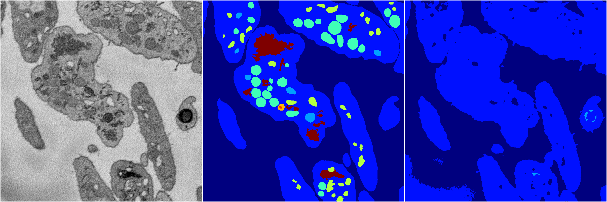
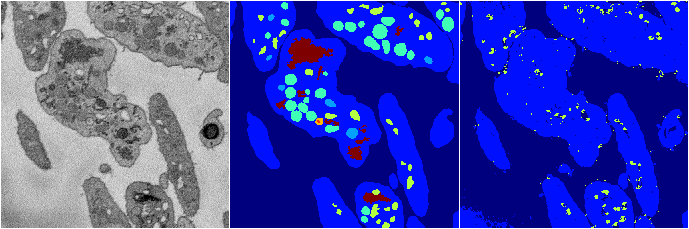
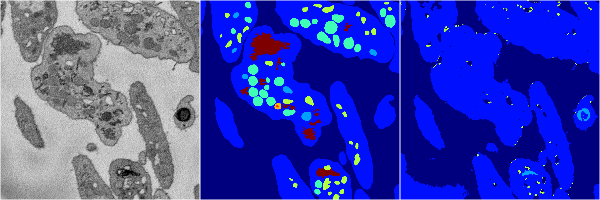

[Back](..)&nbsp;&nbsp;&nbsp;&nbsp;&nbsp;[Home](https://leapmanlab.github.io/snapshots)

---

<a href="3"><h2>random_2d_ed / 1216 / 32 / 3</h2></a>
Created 21 Dec 2018, 14:17:42

<i>Click for more details</i>

**ari**: 0.5860. **miou**: 0.2009. **accuracy**: 0.8321. **n_params**: 272945.0000. 

---

<a href="4"><h2>random_2d_ed / 1216 / 32 / 4</h2></a>
Created 21 Dec 2018, 14:17:42

<i>Click for more details</i>

**ari**: 0.6344. **miou**: 0.2550. **accuracy**: 0.8460. **n_params**: 272945.0000. 

---

<a href="2"><h2>random_2d_ed / 1216 / 32 / 2</h2></a>
Created 21 Dec 2018, 14:17:42

<i>Click for more details</i>

**ari**: 0.6545. **miou**: 0.2635. **accuracy**: 0.8383. **n_params**: 272945.0000. 

---

<a href="1"><h2>random_2d_ed / 1216 / 32 / 1</h2></a>
Created 21 Dec 2018, 14:17:42

<i>Click for more details</i>

**ari**: 0.5819. **miou**: 0.2003. **accuracy**: 0.8311. **n_params**: 272945.0000. 

---

<a href="0"><h2>random_2d_ed / 1216 / 32 / 0</h2></a>
Created 21 Dec 2018, 14:17:42

<i>Click for more details</i>

**ari**: 0.6009. **miou**: 0.2276. **accuracy**: 0.8351. **n_params**: 272945.0000. 

---

[Back](..)&nbsp;&nbsp;&nbsp;&nbsp;&nbsp;[Home](https://leapmanlab.github.io/snapshots)

---