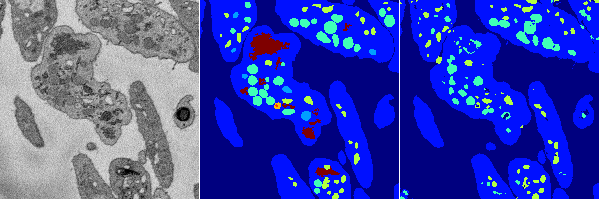
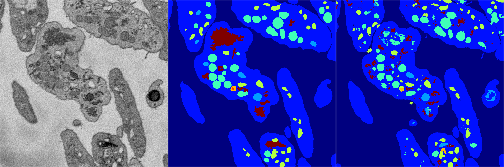
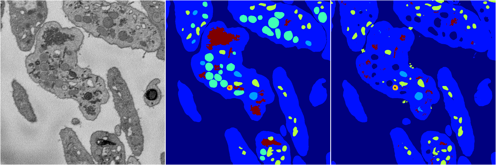
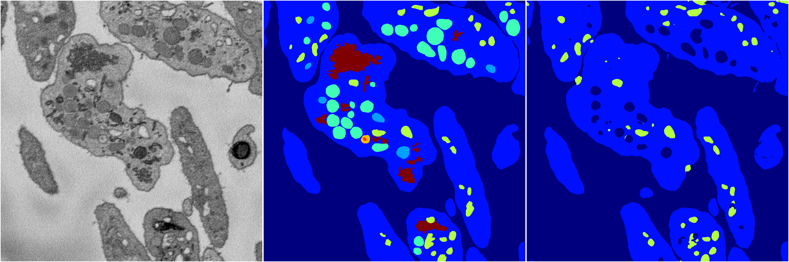

[Back](..)&nbsp;&nbsp;&nbsp;&nbsp;&nbsp;[Home](https://leapmanlab.github.io/snapshots)

---

<a href="0"><h2>random_2d_ed / 1216 / 33 / 0</h2></a>
Created 21 Dec 2018, 01:15:55

<i>Click for more details</i>

**ari**: 0.8015. **miou**: 0.5679. **accuracy**: 0.9138. **n_params**: 5656350.0000. 

---

<a href="3"><h2>random_2d_ed / 1216 / 33 / 3</h2></a>
Created 21 Dec 2018, 01:15:55

<i>Click for more details</i>

**ari**: 0.7656. **miou**: 0.3465. **accuracy**: 0.8939. **n_params**: 5656350.0000. 

---

<a href="1"><h2>random_2d_ed / 1216 / 33 / 1</h2></a>
Created 21 Dec 2018, 01:15:55

<i>Click for more details</i>

**ari**: 0.7947. **miou**: 0.4839. **accuracy**: 0.9072. **n_params**: 5656350.0000. 

---

<a href="4"><h2>random_2d_ed / 1216 / 33 / 4</h2></a>
Created 21 Dec 2018, 01:15:55

<i>Click for more details</i>

**ari**: 0.7552. **miou**: 0.4176. **accuracy**: 0.8920. **n_params**: 5656350.0000. 

---

<a href="2"><h2>random_2d_ed / 1216 / 33 / 2</h2></a>
Created 21 Dec 2018, 01:15:55

<i>Click for more details</i>

**ari**: 0.7264. **miou**: 0.2891. **accuracy**: 0.8799. **n_params**: 5656350.0000. 

---

[Back](..)&nbsp;&nbsp;&nbsp;&nbsp;&nbsp;[Home](https://leapmanlab.github.io/snapshots)

---