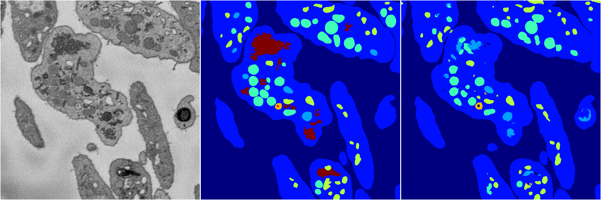
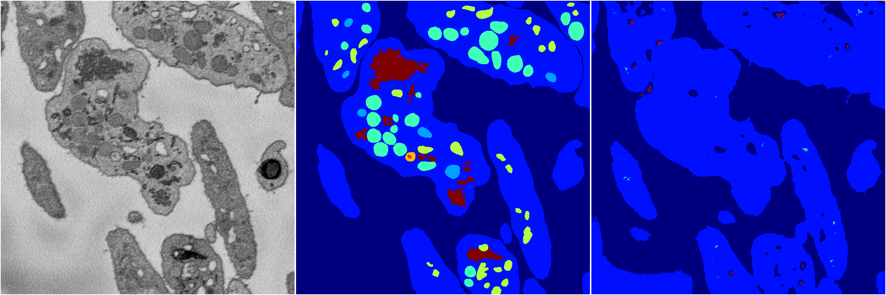
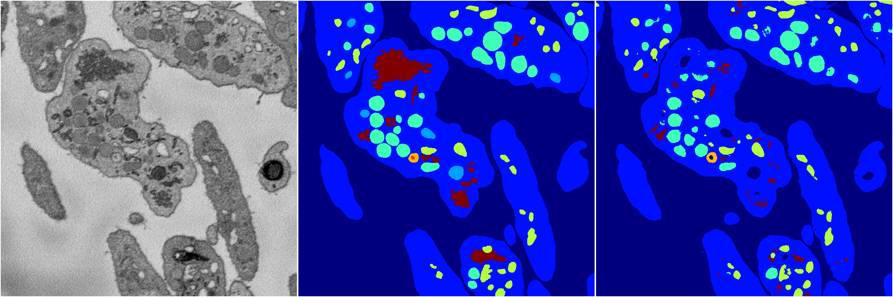
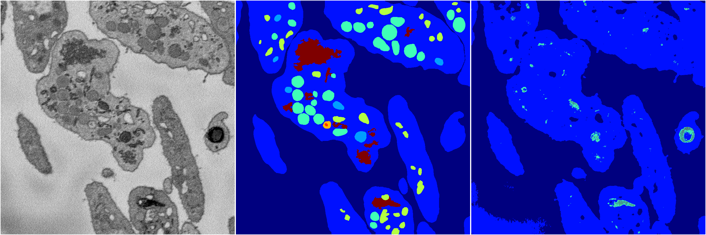

[Back](..)&nbsp;&nbsp;&nbsp;&nbsp;&nbsp;[Home](https://leapmanlab.github.io/snapshots)

---

<a href="3"><h2>random_2d_ed / 1216 / 34 / 3</h2></a>
Created 21 Dec 2018, 14:17:42

<i>Click for more details</i>

**ari**: 0.8148. **miou**: 0.4667. **accuracy**: 0.9188. **n_params**: 3622216.0000. 

---

<a href="4"><h2>random_2d_ed / 1216 / 34 / 4</h2></a>
Created 21 Dec 2018, 14:17:42

<i>Click for more details</i>

**ari**: 0.6574. **miou**: 0.2164. **accuracy**: 0.8629. **n_params**: 3622216.0000. 

---

<a href="2"><h2>random_2d_ed / 1216 / 34 / 2</h2></a>
Created 21 Dec 2018, 14:17:42

<i>Click for more details</i>

**ari**: 0.8007. **miou**: 0.4337. **accuracy**: 0.9148. **n_params**: 3622216.0000. 

---

<a href="1"><h2>random_2d_ed / 1216 / 34 / 1</h2></a>
Created 21 Dec 2018, 14:17:42

<i>Click for more details</i>

**ari**: 0.6595. **miou**: 0.2130. **accuracy**: 0.8590. **n_params**: 3622216.0000. 

---

<a href="0"><h2>random_2d_ed / 1216 / 34 / 0</h2></a>
Created 21 Dec 2018, 14:17:42

<i>Click for more details</i>

**ari**: 0.8149. **miou**: 0.5418. **accuracy**: 0.9172. **n_params**: 3622216.0000. 

---

[Back](..)&nbsp;&nbsp;&nbsp;&nbsp;&nbsp;[Home](https://leapmanlab.github.io/snapshots)

---