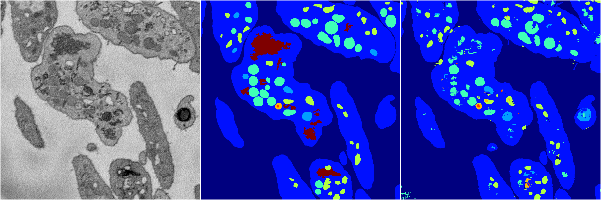
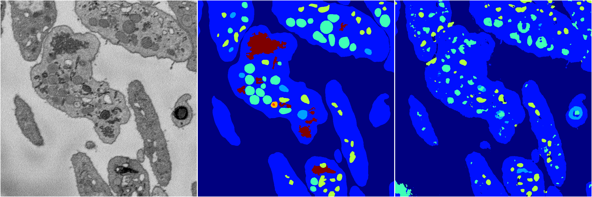
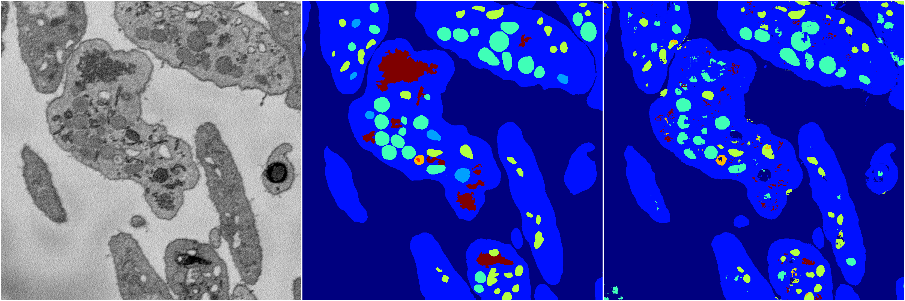
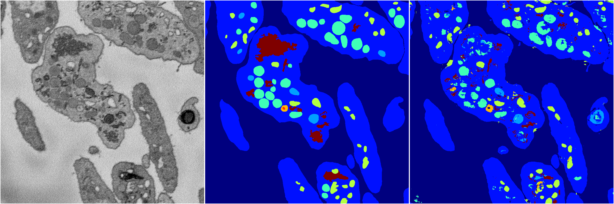

[Back](..)&nbsp;&nbsp;&nbsp;&nbsp;&nbsp;[Home](https://leapmanlab.github.io/snapshots)

---

<a href="4"><h2>random_2d_ed / 1216 / 35 / 4</h2></a>
Created 21 Dec 2018, 14:17:42

<i>Click for more details</i>

**ari**: 0.7766. **miou**: 0.4735. **accuracy**: 0.8991. **n_params**: 373862.0000. 

---

<a href="3"><h2>random_2d_ed / 1216 / 35 / 3</h2></a>
Created 21 Dec 2018, 14:17:42

<i>Click for more details</i>

**ari**: 0.7786. **miou**: 0.4806. **accuracy**: 0.9008. **n_params**: 373862.0000. 

---

<a href="1"><h2>random_2d_ed / 1216 / 35 / 1</h2></a>
Created 21 Dec 2018, 14:17:42

<i>Click for more details</i>

**ari**: 0.7365. **miou**: 0.3515. **accuracy**: 0.8769. **n_params**: 373862.0000. 

---

<a href="2"><h2>random_2d_ed / 1216 / 35 / 2</h2></a>
Created 21 Dec 2018, 14:17:42

<i>Click for more details</i>

**ari**: 0.7605. **miou**: 0.3885. **accuracy**: 0.8912. **n_params**: 373862.0000. 

---

<a href="0"><h2>random_2d_ed / 1216 / 35 / 0</h2></a>
Created 21 Dec 2018, 14:17:42

<i>Click for more details</i>

**ari**: 0.7675. **miou**: 0.4501. **accuracy**: 0.8951. **n_params**: 373862.0000. 

---

[Back](..)&nbsp;&nbsp;&nbsp;&nbsp;&nbsp;[Home](https://leapmanlab.github.io/snapshots)

---