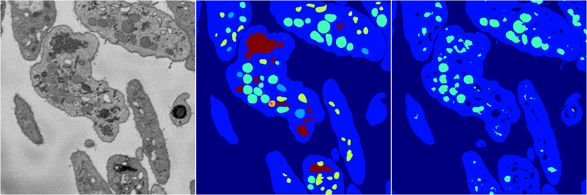
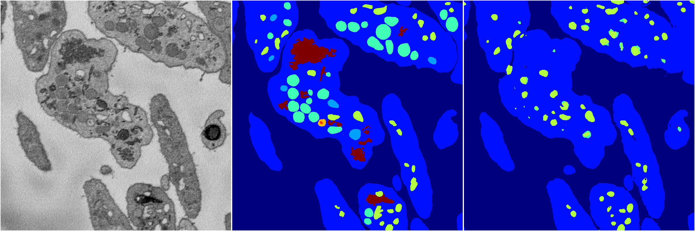
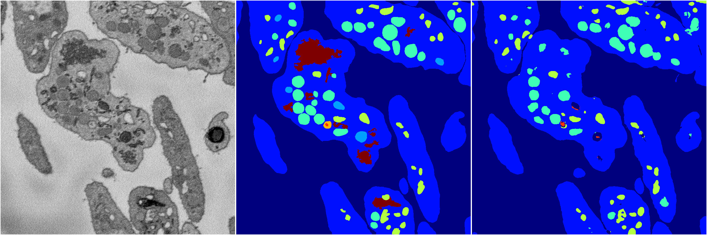
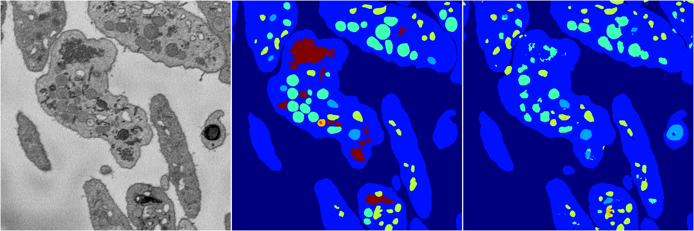

[Back](..)&nbsp;&nbsp;&nbsp;&nbsp;&nbsp;[Home](https://leapmanlab.github.io/snapshots)

---

<a href="0"><h2>random_2d_ed / 1216 / 36 / 0</h2></a>
Created 21 Dec 2018, 01:15:55

<i>Click for more details</i>

**ari**: 0.8020. **miou**: 0.5443. **accuracy**: 0.9142. **n_params**: 6426283.0000. 

---

<a href="3"><h2>random_2d_ed / 1216 / 36 / 3</h2></a>
Created 21 Dec 2018, 01:15:55

<i>Click for more details</i>

**ari**: 0.7425. **miou**: 0.2695. **accuracy**: 0.8805. **n_params**: 6426283.0000. 

---

<a href="1"><h2>random_2d_ed / 1216 / 36 / 1</h2></a>
Created 21 Dec 2018, 01:15:55

<i>Click for more details</i>

**ari**: 0.7489. **miou**: 0.2813. **accuracy**: 0.8857. **n_params**: 6426283.0000. 

---

<a href="4"><h2>random_2d_ed / 1216 / 36 / 4</h2></a>
Created 21 Dec 2018, 01:15:55

<i>Click for more details</i>

**ari**: 0.7863. **miou**: 0.3954. **accuracy**: 0.9055. **n_params**: 6426283.0000. 

---

<a href="2"><h2>random_2d_ed / 1216 / 36 / 2</h2></a>
Created 21 Dec 2018, 01:15:55

<i>Click for more details</i>

**ari**: 0.7919. **miou**: 0.4251. **accuracy**: 0.9051. **n_params**: 6426283.0000. 

---

[Back](..)&nbsp;&nbsp;&nbsp;&nbsp;&nbsp;[Home](https://leapmanlab.github.io/snapshots)

---