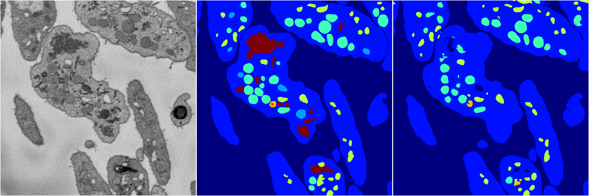
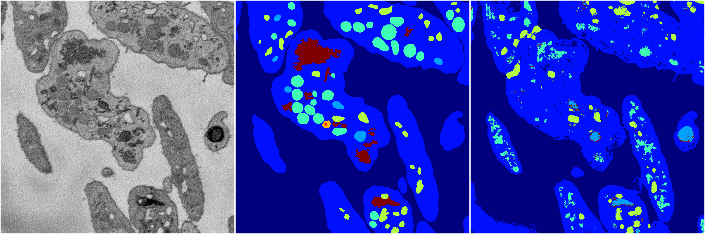
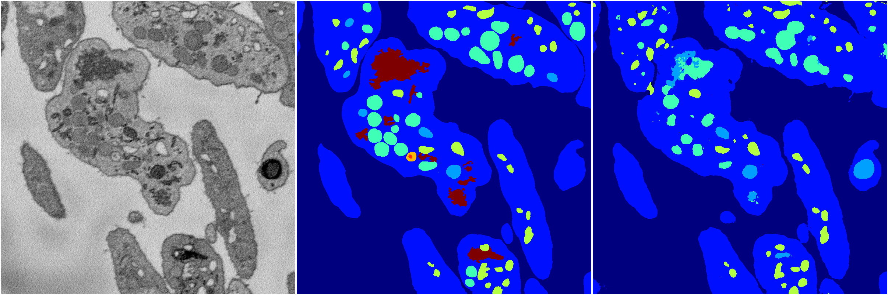
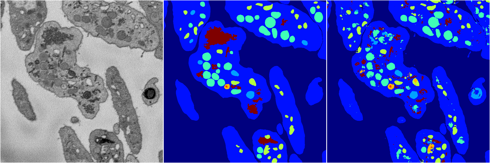

[Back](..)&nbsp;&nbsp;&nbsp;&nbsp;&nbsp;[Home](https://leapmanlab.github.io/snapshots)

---

<a href="4"><h2>random_2d_ed / 1216 / 37 / 4</h2></a>
Created 21 Dec 2018, 14:17:43

<i>Click for more details</i>

**ari**: 0.8090. **miou**: 0.5425. **accuracy**: 0.9164. **n_params**: 1598914.0000. 

---

<a href="3"><h2>random_2d_ed / 1216 / 37 / 3</h2></a>
Created 21 Dec 2018, 14:17:43

<i>Click for more details</i>

**ari**: 0.7947. **miou**: 0.4199. **accuracy**: 0.9120. **n_params**: 1598914.0000. 

---

<a href="2"><h2>random_2d_ed / 1216 / 37 / 2</h2></a>
Created 21 Dec 2018, 14:17:43

<i>Click for more details</i>

**ari**: 0.6646. **miou**: 0.2976. **accuracy**: 0.8446. **n_params**: 1598914.0000. 

---

<a href="1"><h2>random_2d_ed / 1216 / 37 / 1</h2></a>
Created 21 Dec 2018, 14:17:43

<i>Click for more details</i>

**ari**: 0.8000. **miou**: 0.3955. **accuracy**: 0.9075. **n_params**: 1598914.0000. 

---

<a href="0"><h2>random_2d_ed / 1216 / 37 / 0</h2></a>
Created 21 Dec 2018, 14:17:43

<i>Click for more details</i>

**ari**: 0.7957. **miou**: 0.4940. **accuracy**: 0.9053. **n_params**: 1598914.0000. 

---

[Back](..)&nbsp;&nbsp;&nbsp;&nbsp;&nbsp;[Home](https://leapmanlab.github.io/snapshots)

---