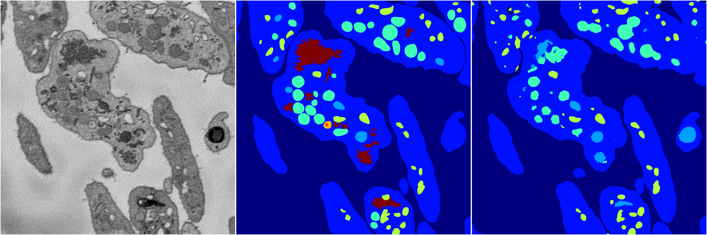
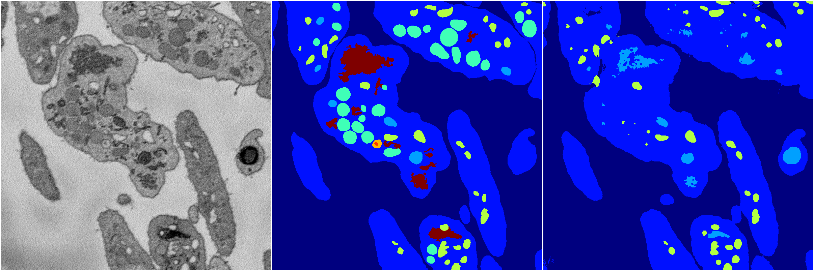
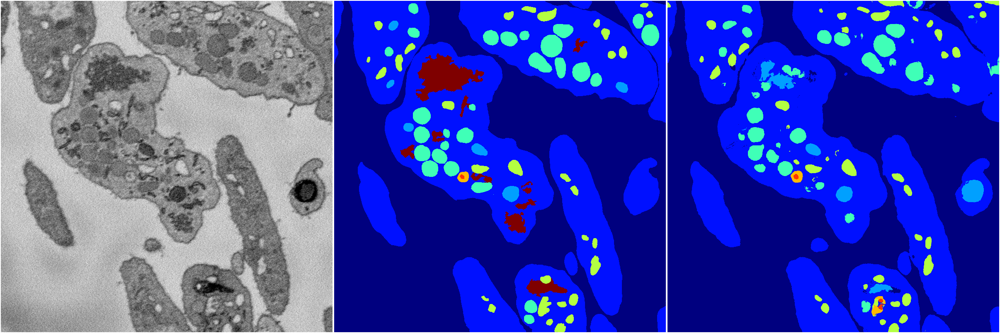
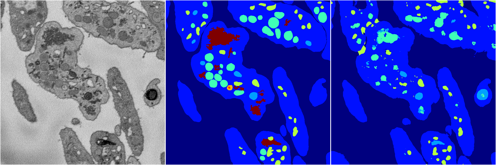
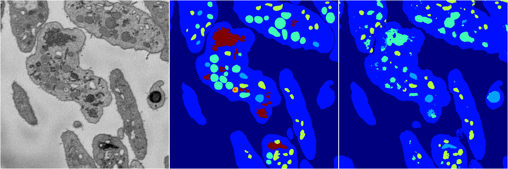

[Back](..)&nbsp;&nbsp;&nbsp;&nbsp;&nbsp;[Home](https://leapmanlab.github.io/snapshots)

---

<a href="4"><h2>random_2d_ed / 1216 / 38 / 4</h2></a>
Created 17 Dec 2018, 02:57:40

<i>Click for more details</i>

**ari**: 0.8062. **miou**: 0.4046. **accuracy**: 0.9117. **n_params**: 5405088.0000. 

---

<a href="3"><h2>random_2d_ed / 1216 / 38 / 3</h2></a>
Created 17 Dec 2018, 02:57:40

<i>Click for more details</i>

**ari**: 0.7734. **miou**: 0.3277. **accuracy**: 0.8980. **n_params**: 5405088.0000. 

---

<a href="2"><h2>random_2d_ed / 1216 / 38 / 2</h2></a>
Created 17 Dec 2018, 02:57:40

<i>Click for more details</i>

**ari**: 0.8136. **miou**: 0.5388. **accuracy**: 0.9186. **n_params**: 5405088.0000. 

---

<a href="1"><h2>random_2d_ed / 1216 / 38 / 1</h2></a>
Created 17 Dec 2018, 02:57:40

<i>Click for more details</i>

**ari**: 0.7764. **miou**: 0.3574. **accuracy**: 0.8969. **n_params**: 5405088.0000. 

---

<a href="0"><h2>random_2d_ed / 1216 / 38 / 0</h2></a>
Created 17 Dec 2018, 02:57:40

<i>Click for more details</i>

**ari**: 0.7864. **miou**: 0.3702. **accuracy**: 0.8993. **n_params**: 5405088.0000. 

---

[Back](..)&nbsp;&nbsp;&nbsp;&nbsp;&nbsp;[Home](https://leapmanlab.github.io/snapshots)

---