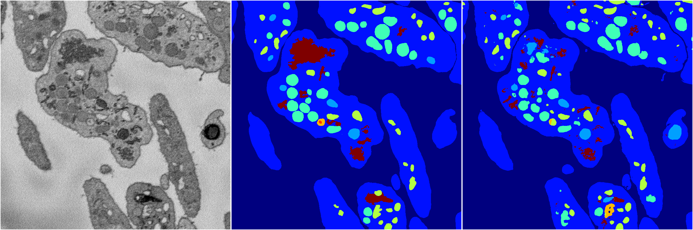
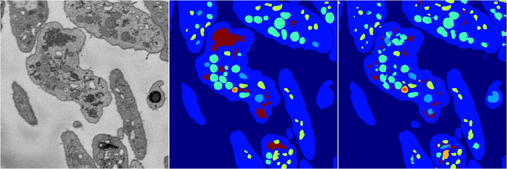
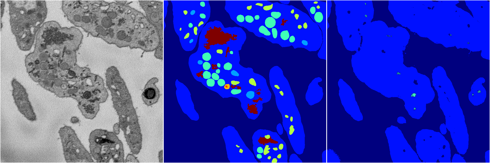
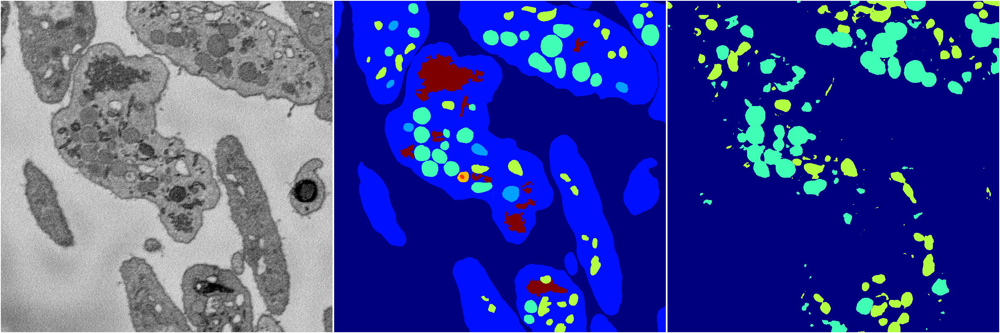

[Back](..)&nbsp;&nbsp;&nbsp;&nbsp;&nbsp;[Home](https://leapmanlab.github.io/snapshots)

---

<a href="4"><h2>random_2d_ed / 1216 / 39 / 4</h2></a>
Created 21 Dec 2018, 14:17:43

<i>Click for more details</i>

**ari**: 0.8162. **miou**: 0.4928. **accuracy**: 0.9191. **n_params**: 6895552.0000. 

---

<a href="3"><h2>random_2d_ed / 1216 / 39 / 3</h2></a>
Created 21 Dec 2018, 14:17:43

<i>Click for more details</i>

**ari**: 0.8199. **miou**: 0.5333. **accuracy**: 0.9186. **n_params**: 6895552.0000. 

---

<a href="2"><h2>random_2d_ed / 1216 / 39 / 2</h2></a>
Created 21 Dec 2018, 14:17:43

<i>Click for more details</i>

**ari**: 0.7171. **miou**: 0.2147. **accuracy**: 0.8808. **n_params**: 6895552.0000. 

---

<a href="1"><h2>random_2d_ed / 1216 / 39 / 1</h2></a>
Created 21 Dec 2018, 14:17:43

<i>Click for more details</i>

**ari**: 0.8251. **miou**: 0.5730. **accuracy**: 0.9229. **n_params**: 6895552.0000. 

---

<a href="0"><h2>random_2d_ed / 1216 / 39 / 0</h2></a>
Created 21 Dec 2018, 14:17:43

<i>Click for more details</i>

**ari**: 0.1455. **miou**: 0.1719. **accuracy**: 0.5249. **n_params**: 6895552.0000. 

---

[Back](..)&nbsp;&nbsp;&nbsp;&nbsp;&nbsp;[Home](https://leapmanlab.github.io/snapshots)

---