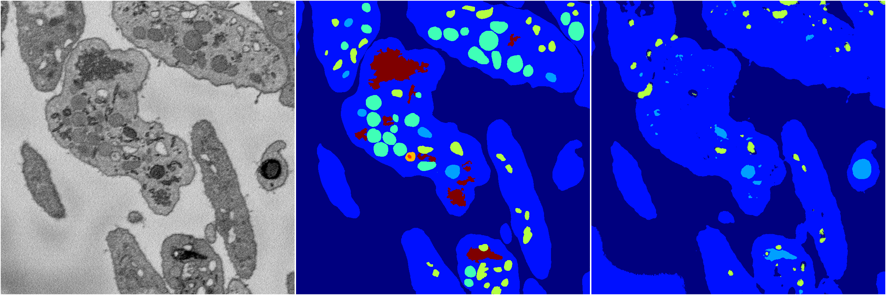
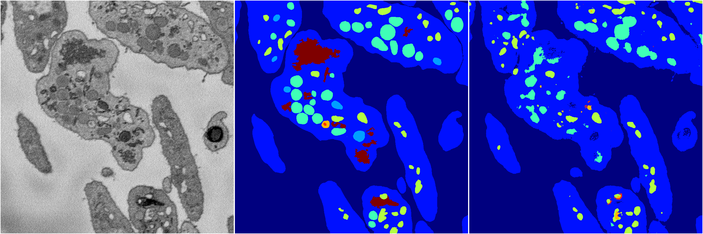
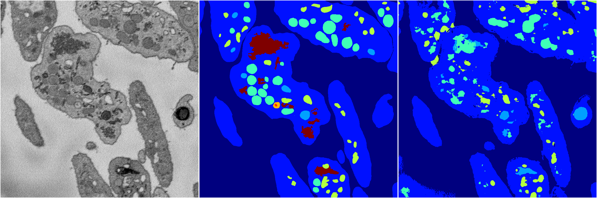
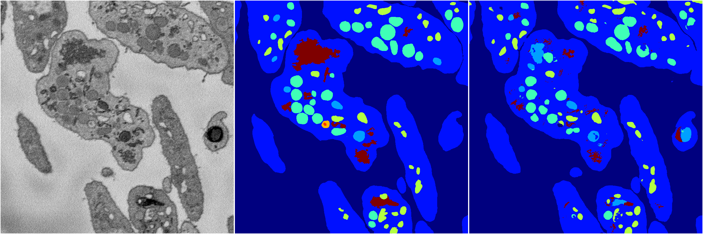

[Back](..)&nbsp;&nbsp;&nbsp;&nbsp;&nbsp;[Home](https://leapmanlab.github.io/snapshots)

---

<a href="0"><h2>random_2d_ed / 1216 / 4 / 0</h2></a>
Created 21 Dec 2018, 01:15:55

<i>Click for more details</i>

**ari**: 0.7992. **miou**: 0.4983. **accuracy**: 0.9173. **n_params**: 5435039.0000. 

---

<a href="3"><h2>random_2d_ed / 1216 / 4 / 3</h2></a>
Created 21 Dec 2018, 01:15:55

<i>Click for more details</i>

**ari**: 0.6802. **miou**: 0.2752. **accuracy**: 0.8721. **n_params**: 5435039.0000. 

---

<a href="1"><h2>random_2d_ed / 1216 / 4 / 1</h2></a>
Created 21 Dec 2018, 01:15:55

<i>Click for more details</i>

**ari**: 0.7571. **miou**: 0.3624. **accuracy**: 0.8996. **n_params**: 5435039.0000. 

---

<a href="4"><h2>random_2d_ed / 1216 / 4 / 4</h2></a>
Created 21 Dec 2018, 01:15:55

<i>Click for more details</i>

**ari**: 0.7177. **miou**: 0.3417. **accuracy**: 0.8773. **n_params**: 5435039.0000. 

---

<a href="2"><h2>random_2d_ed / 1216 / 4 / 2</h2></a>
Created 21 Dec 2018, 01:15:55

<i>Click for more details</i>

**ari**: 0.8043. **miou**: 0.4670. **accuracy**: 0.9205. **n_params**: 5435039.0000. 

---

[Back](..)&nbsp;&nbsp;&nbsp;&nbsp;&nbsp;[Home](https://leapmanlab.github.io/snapshots)

---