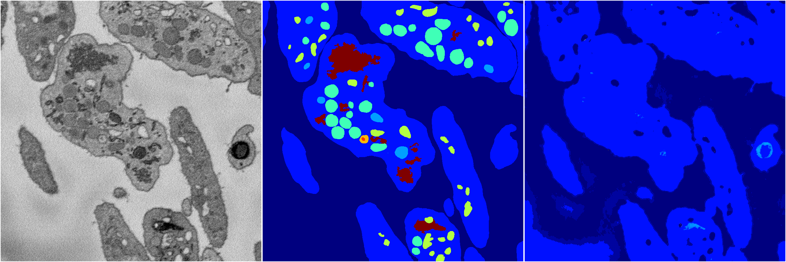
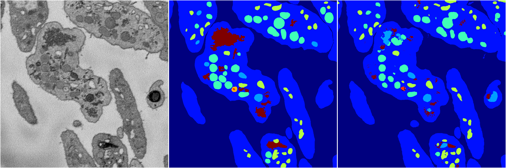
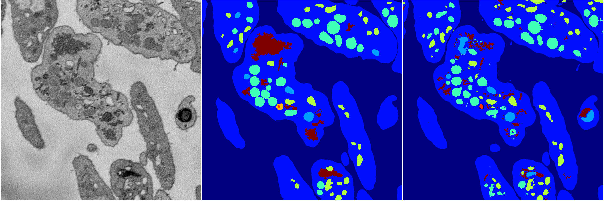
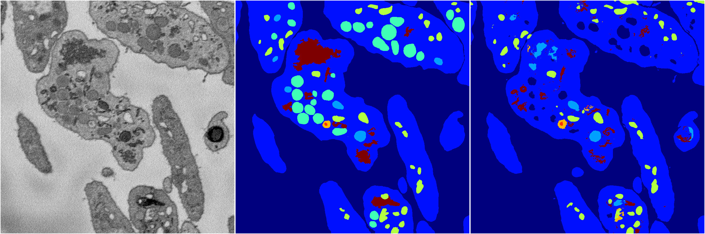

[Back](..)&nbsp;&nbsp;&nbsp;&nbsp;&nbsp;[Home](https://leapmanlab.github.io/snapshots)

---

<a href="4"><h2>random_2d_ed / 1216 / 40 / 4</h2></a>
Created 21 Dec 2018, 14:17:43

<i>Click for more details</i>

**ari**: 0.6103. **miou**: 0.2065. **accuracy**: 0.8480. **n_params**: 1822954.0000. 

---

<a href="3"><h2>random_2d_ed / 1216 / 40 / 3</h2></a>
Created 21 Dec 2018, 14:17:43

<i>Click for more details</i>

**ari**: 0.8198. **miou**: 0.4892. **accuracy**: 0.9191. **n_params**: 1822954.0000. 

---

<a href="2"><h2>random_2d_ed / 1216 / 40 / 2</h2></a>
Created 21 Dec 2018, 14:17:43

<i>Click for more details</i>

**ari**: 0.8145. **miou**: 0.5236. **accuracy**: 0.9178. **n_params**: 1822954.0000. 

---

<a href="1"><h2>random_2d_ed / 1216 / 40 / 1</h2></a>
Created 21 Dec 2018, 14:17:43

<i>Click for more details</i>

**ari**: 0.8143. **miou**: 0.5400. **accuracy**: 0.9177. **n_params**: 1822954.0000. 

---

<a href="0"><h2>random_2d_ed / 1216 / 40 / 0</h2></a>
Created 21 Dec 2018, 14:17:43

<i>Click for more details</i>

**ari**: 0.7743. **miou**: 0.4737. **accuracy**: 0.9011. **n_params**: 1822954.0000. 

---

[Back](..)&nbsp;&nbsp;&nbsp;&nbsp;&nbsp;[Home](https://leapmanlab.github.io/snapshots)

---