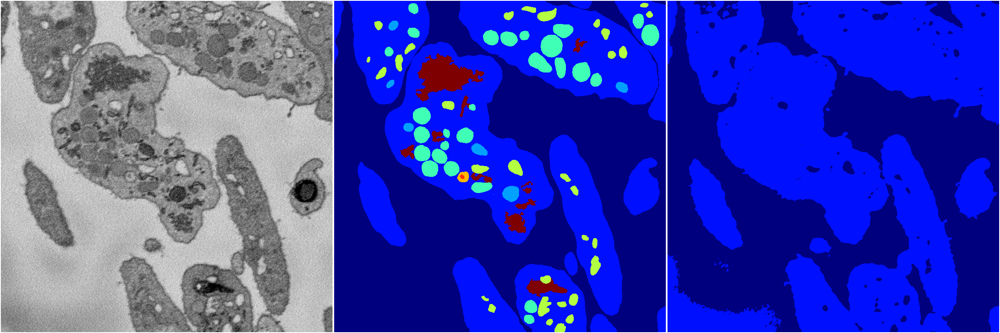
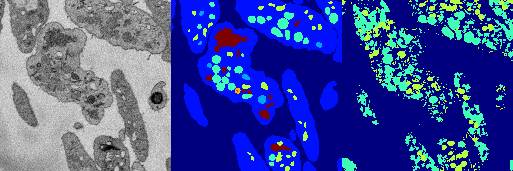
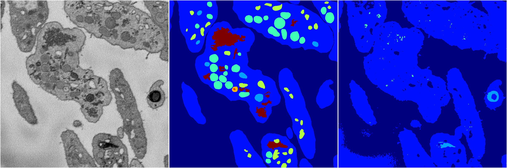
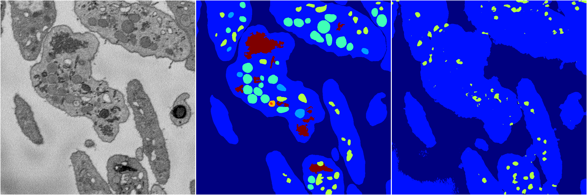

[Back](..)&nbsp;&nbsp;&nbsp;&nbsp;&nbsp;[Home](https://leapmanlab.github.io/snapshots)

---

<a href="4"><h2>random_2d_ed / 1216 / 41 / 4</h2></a>
Created 21 Dec 2018, 14:17:43

<i>Click for more details</i>

**ari**: 0.5952. **miou**: 0.2007. **accuracy**: 0.8380. **n_params**: 79030.0000. 

---

<a href="3"><h2>random_2d_ed / 1216 / 41 / 3</h2></a>
Created 21 Dec 2018, 14:17:43

<i>Click for more details</i>

**ari**: 0.7166. **miou**: 0.2862. **accuracy**: 0.8763. **n_params**: 79030.0000. 

---

<a href="2"><h2>random_2d_ed / 1216 / 41 / 2</h2></a>
Created 21 Dec 2018, 14:17:43

<i>Click for more details</i>

**ari**: 0.1796. **miou**: 0.1274. **accuracy**: 0.4732. **n_params**: 79030.0000. 

---

<a href="1"><h2>random_2d_ed / 1216 / 41 / 1</h2></a>
Created 21 Dec 2018, 14:17:43

<i>Click for more details</i>

**ari**: 0.5990. **miou**: 0.2079. **accuracy**: 0.8361. **n_params**: 79030.0000. 

---

<a href="0"><h2>random_2d_ed / 1216 / 41 / 0</h2></a>
Created 21 Dec 2018, 14:17:43

<i>Click for more details</i>

**ari**: 0.5328. **miou**: 0.2422. **accuracy**: 0.8233. **n_params**: 79030.0000. 

---

[Back](..)&nbsp;&nbsp;&nbsp;&nbsp;&nbsp;[Home](https://leapmanlab.github.io/snapshots)

---