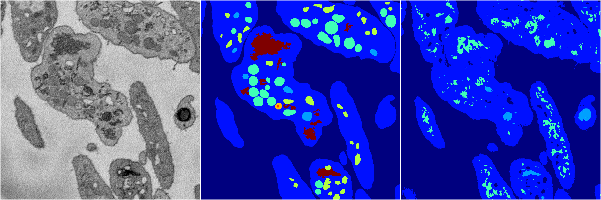
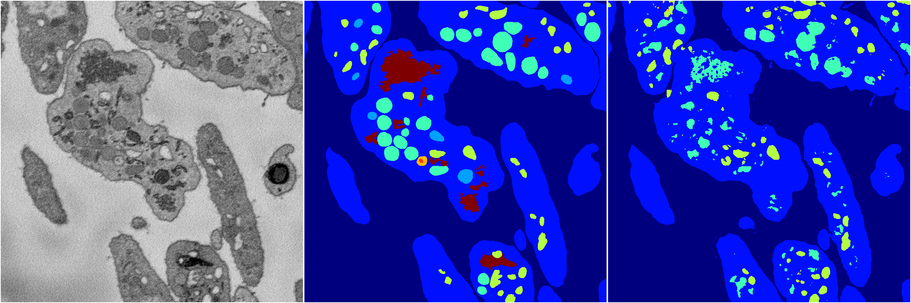
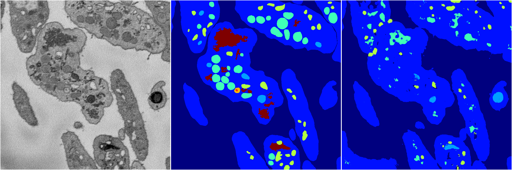

[Back](..)&nbsp;&nbsp;&nbsp;&nbsp;&nbsp;[Home](https://leapmanlab.github.io/snapshots)

---

<a href="4"><h2>random_2d_ed / 1216 / 42 / 4</h2></a>
Created 21 Dec 2018, 14:17:43

<i>Click for more details</i>

**ari**: 0.6649. **miou**: 0.2591. **accuracy**: 0.8618. **n_params**: 4018424.0000. 

---

<a href="3"><h2>random_2d_ed / 1216 / 42 / 3</h2></a>
Created 21 Dec 2018, 14:17:43

<i>Click for more details</i>

**ari**: 0.7454. **miou**: 0.3805. **accuracy**: 0.8975. **n_params**: 4018424.0000. 

---

<a href="2"><h2>random_2d_ed / 1216 / 42 / 2</h2></a>
Created 21 Dec 2018, 14:17:43

<i>Click for more details</i>

**ari**: 0.7093. **miou**: 0.2947. **accuracy**: 0.8893. **n_params**: 4018424.0000. 

---

<a href="1"><h2>random_2d_ed / 1216 / 42 / 1</h2></a>
Created 21 Dec 2018, 14:17:43

<i>Click for more details</i>

**ari**: 0.7183. **miou**: 0.3205. **accuracy**: 0.8844. **n_params**: 4018424.0000. 

---

<a href="0"><h2>random_2d_ed / 1216 / 42 / 0</h2></a>
Created 21 Dec 2018, 14:17:43

<i>Click for more details</i>

**ari**: 0.6520. **miou**: 0.2838. **accuracy**: 0.8638. **n_params**: 4018424.0000. 

---

[Back](..)&nbsp;&nbsp;&nbsp;&nbsp;&nbsp;[Home](https://leapmanlab.github.io/snapshots)

---