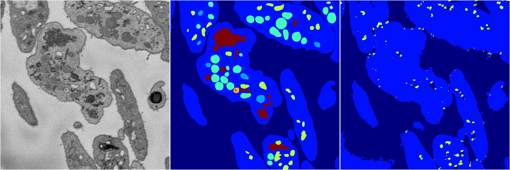
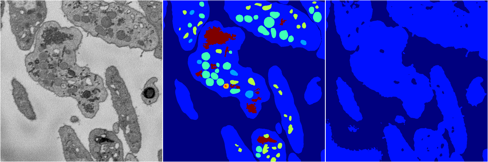

[Back](..)&nbsp;&nbsp;&nbsp;&nbsp;&nbsp;[Home](https://leapmanlab.github.io/snapshots)

---

<a href="0"><h2>random_2d_ed / 1216 / 43 / 0</h2></a>
Created 21 Dec 2018, 01:15:55

<i>Click for more details</i>

**ari**: 0.6273. **miou**: 0.2396. **accuracy**: 0.8451. **n_params**: 783040.0000. 

---

<a href="3"><h2>random_2d_ed / 1216 / 43 / 3</h2></a>
Created 21 Dec 2018, 01:15:55

<i>Click for more details</i>

**ari**: 0.6249. **miou**: 0.2330. **accuracy**: 0.8439. **n_params**: 783040.0000. 

---

<a href="1"><h2>random_2d_ed / 1216 / 43 / 1</h2></a>
Created 21 Dec 2018, 01:15:55

<i>Click for more details</i>

**ari**: 0.6031. **miou**: 0.2025. **accuracy**: 0.8370. **n_params**: 783040.0000. 

---

<a href="4"><h2>random_2d_ed / 1216 / 43 / 4</h2></a>
Created 21 Dec 2018, 01:15:55

<i>Click for more details</i>

**ari**: 0.7101. **miou**: 0.3651. **accuracy**: 0.8582. **n_params**: 783040.0000. 

---

<a href="2"><h2>random_2d_ed / 1216 / 43 / 2</h2></a>
Created 21 Dec 2018, 01:15:55

<i>Click for more details</i>

**ari**: 0.5802. **miou**: 0.2001. **accuracy**: 0.8311. **n_params**: 783040.0000. 

---

[Back](..)&nbsp;&nbsp;&nbsp;&nbsp;&nbsp;[Home](https://leapmanlab.github.io/snapshots)

---