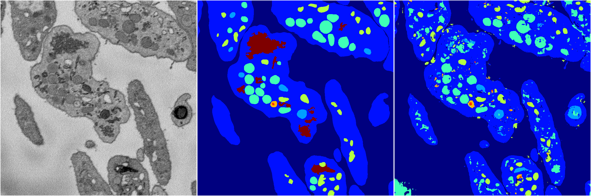
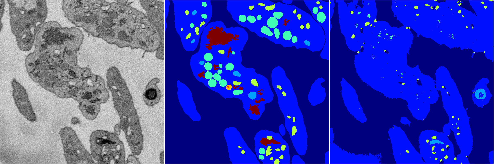
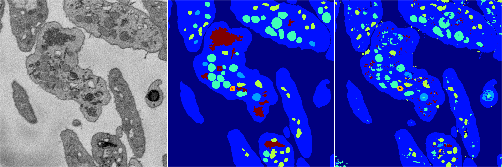

[Back](..)&nbsp;&nbsp;&nbsp;&nbsp;&nbsp;[Home](https://leapmanlab.github.io/snapshots)

---

<a href="4"><h2>random_2d_ed / 1216 / 44 / 4</h2></a>
Created 17 Dec 2018, 02:57:41

<i>Click for more details</i>

**ari**: 0.7305. **miou**: 0.4128. **accuracy**: 0.8708. **n_params**: 640959.0000. 

---

<a href="3"><h2>random_2d_ed / 1216 / 44 / 3</h2></a>
Created 17 Dec 2018, 02:57:41

<i>Click for more details</i>

**ari**: 0.6242. **miou**: 0.2369. **accuracy**: 0.8430. **n_params**: 640959.0000. 

---

<a href="2"><h2>random_2d_ed / 1216 / 44 / 2</h2></a>
Created 17 Dec 2018, 02:57:41

<i>Click for more details</i>

**ari**: 0.7635. **miou**: 0.4379. **accuracy**: 0.8913. **n_params**: 640959.0000. 

---

<a href="1"><h2>random_2d_ed / 1216 / 44 / 1</h2></a>
Created 17 Dec 2018, 02:57:41

<i>Click for more details</i>

**ari**: 0.7304. **miou**: 0.3293. **accuracy**: 0.8763. **n_params**: 640959.0000. 

---

<a href="0"><h2>random_2d_ed / 1216 / 44 / 0</h2></a>
Created 17 Dec 2018, 02:57:41

<i>Click for more details</i>

**ari**: 0.7638. **miou**: 0.4434. **accuracy**: 0.8919. **n_params**: 640959.0000. 

---

[Back](..)&nbsp;&nbsp;&nbsp;&nbsp;&nbsp;[Home](https://leapmanlab.github.io/snapshots)

---