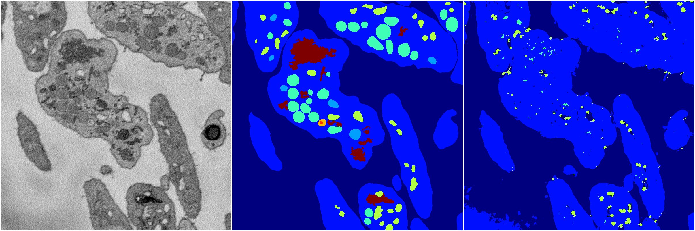
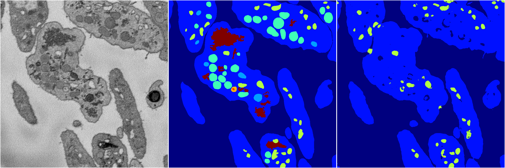
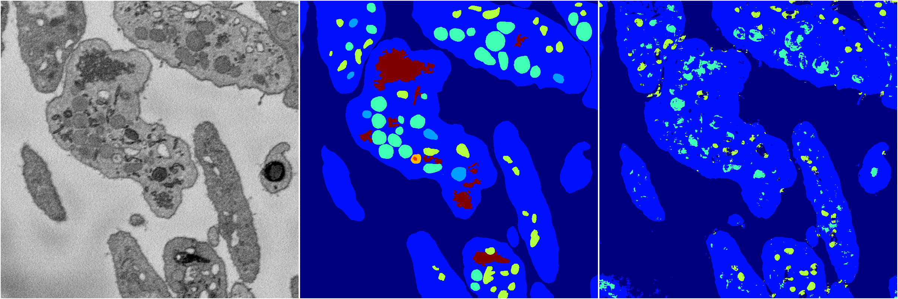

[Back](..)&nbsp;&nbsp;&nbsp;&nbsp;&nbsp;[Home](https://leapmanlab.github.io/snapshots)

---

<a href="0"><h2>random_2d_ed / 1216 / 45 / 0</h2></a>
Created 21 Dec 2018, 01:15:55

<i>Click for more details</i>

**ari**: 0.5610. **miou**: 0.2500. **accuracy**: 0.8659. **n_params**: 10932082.0000. 

---

<a href="3"><h2>random_2d_ed / 1216 / 45 / 3</h2></a>
Created 21 Dec 2018, 01:15:55

<i>Click for more details</i>

**ari**: 0.5860. **miou**: 0.2748. **accuracy**: 0.8698. **n_params**: 10932082.0000. 

---

<a href="1"><h2>random_2d_ed / 1216 / 45 / 1</h2></a>
Created 21 Dec 2018, 01:15:55

<i>Click for more details</i>

**ari**: 0.6626. **miou**: 0.2943. **accuracy**: 0.8897. **n_params**: 10932082.0000. 

---

<a href="4"><h2>random_2d_ed / 1216 / 45 / 4</h2></a>
Created 21 Dec 2018, 01:15:55

<i>Click for more details</i>

**ari**: 0.6179. **miou**: 0.2833. **accuracy**: 0.8752. **n_params**: 10932082.0000. 

---

<a href="2"><h2>random_2d_ed / 1216 / 45 / 2</h2></a>
Created 21 Dec 2018, 01:15:55

<i>Click for more details</i>

**ari**: 0.6133. **miou**: 0.2975. **accuracy**: 0.8746. **n_params**: 10932082.0000. 

---

[Back](..)&nbsp;&nbsp;&nbsp;&nbsp;&nbsp;[Home](https://leapmanlab.github.io/snapshots)

---