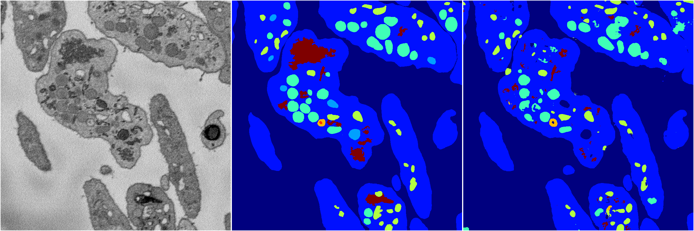
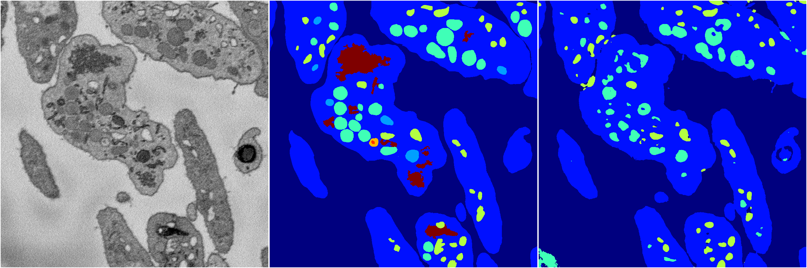
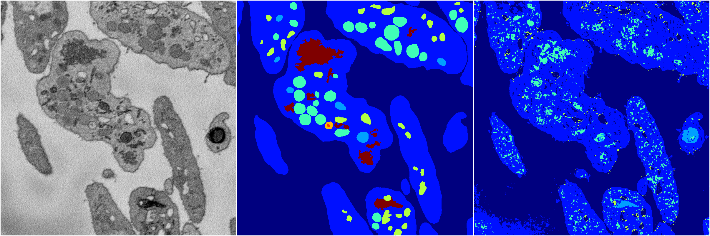
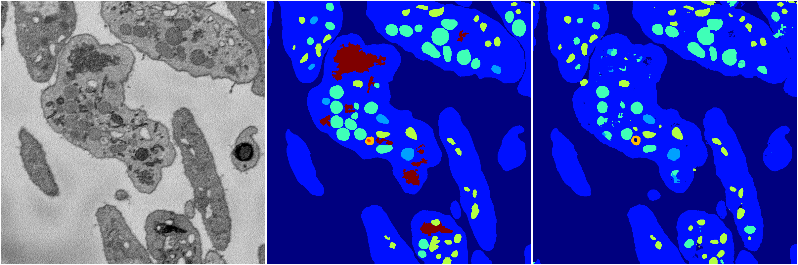

[Back](..)&nbsp;&nbsp;&nbsp;&nbsp;&nbsp;[Home](https://leapmanlab.github.io/snapshots)

---

<a href="4"><h2>random_2d_ed / 1216 / 47 / 4</h2></a>
Created 21 Dec 2018, 01:15:55

<i>Click for more details</i>

**ari**: 0.7917. **miou**: 0.5389. **accuracy**: 0.9074. **n_params**: 3719100.0000. 

---

<a href="2"><h2>random_2d_ed / 1216 / 47 / 2</h2></a>
Created 21 Dec 2018, 01:15:55

<i>Click for more details</i>

**ari**: 0.7730. **miou**: 0.4258. **accuracy**: 0.9014. **n_params**: 3719100.0000. 

---

<a href="0"><h2>random_2d_ed / 1216 / 47 / 0</h2></a>
Created 21 Dec 2018, 01:15:55

<i>Click for more details</i>

**ari**: 0.7604. **miou**: 0.3345. **accuracy**: 0.8894. **n_params**: 3719100.0000. 

---

<a href="3"><h2>random_2d_ed / 1216 / 47 / 3</h2></a>
Created 21 Dec 2018, 01:15:55

<i>Click for more details</i>

**ari**: 0.6083. **miou**: 0.2391. **accuracy**: 0.8190. **n_params**: 3719100.0000. 

---

<a href="1"><h2>random_2d_ed / 1216 / 47 / 1</h2></a>
Created 21 Dec 2018, 01:15:55

<i>Click for more details</i>

**ari**: 0.7898. **miou**: 0.4721. **accuracy**: 0.9087. **n_params**: 3719100.0000. 

---

[Back](..)&nbsp;&nbsp;&nbsp;&nbsp;&nbsp;[Home](https://leapmanlab.github.io/snapshots)

---