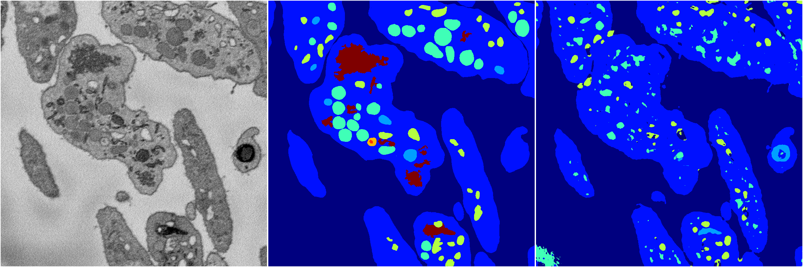
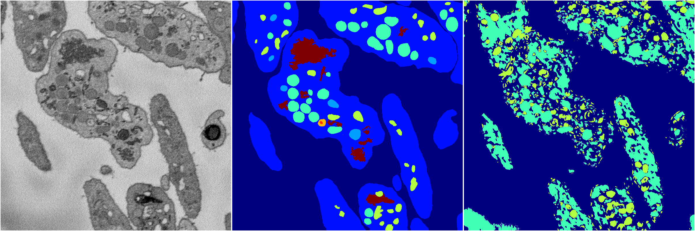
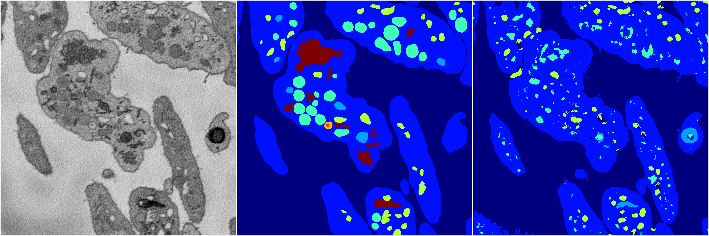
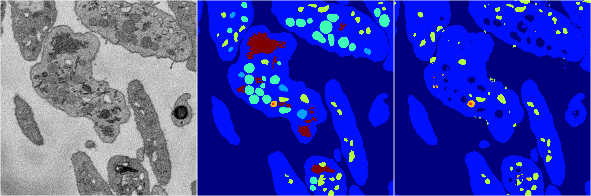

[Back](..)&nbsp;&nbsp;&nbsp;&nbsp;&nbsp;[Home](https://leapmanlab.github.io/snapshots)

---

<a href="0"><h2>random_2d_ed / 1216 / 48 / 0</h2></a>
Created 21 Dec 2018, 01:15:55

<i>Click for more details</i>

**ari**: 0.7069. **miou**: 0.2951. **accuracy**: 0.8654. **n_params**: 801037.0000. 

---

<a href="3"><h2>random_2d_ed / 1216 / 48 / 3</h2></a>
Created 21 Dec 2018, 01:15:55

<i>Click for more details</i>

**ari**: 0.7411. **miou**: 0.3549. **accuracy**: 0.8847. **n_params**: 801037.0000. 

---

<a href="1"><h2>random_2d_ed / 1216 / 48 / 1</h2></a>
Created 21 Dec 2018, 01:15:55

<i>Click for more details</i>

**ari**: 0.1907. **miou**: 0.1176. **accuracy**: 0.4627. **n_params**: 801037.0000. 

---

<a href="4"><h2>random_2d_ed / 1216 / 48 / 4</h2></a>
Created 21 Dec 2018, 01:15:55

<i>Click for more details</i>

**ari**: 0.6906. **miou**: 0.2996. **accuracy**: 0.8581. **n_params**: 801037.0000. 

---

<a href="2"><h2>random_2d_ed / 1216 / 48 / 2</h2></a>
Created 21 Dec 2018, 01:15:55

<i>Click for more details</i>

**ari**: 0.7101. **miou**: 0.3463. **accuracy**: 0.8720. **n_params**: 801037.0000. 

---

[Back](..)&nbsp;&nbsp;&nbsp;&nbsp;&nbsp;[Home](https://leapmanlab.github.io/snapshots)

---