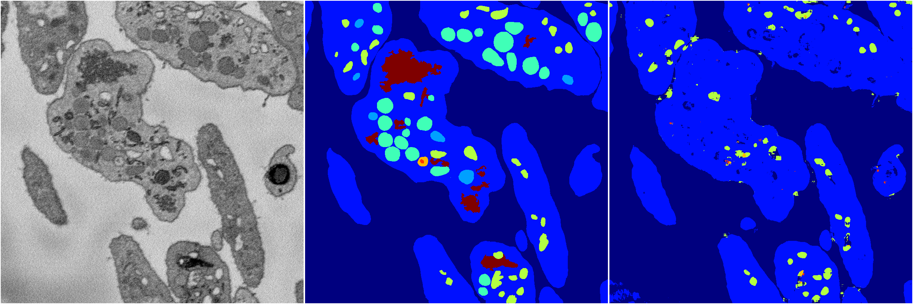
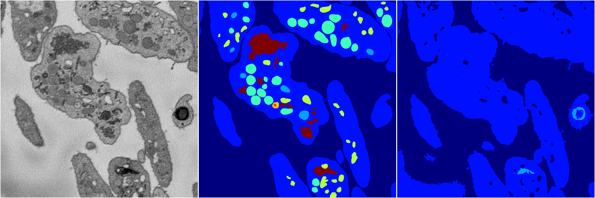
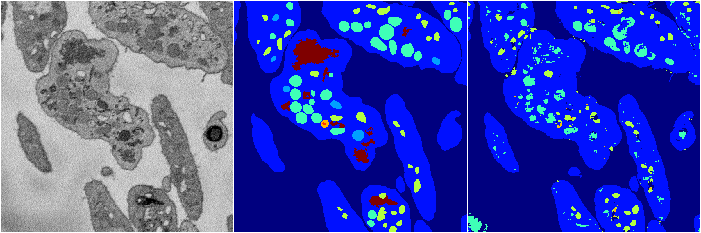
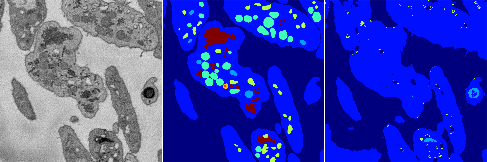

[Back](..)&nbsp;&nbsp;&nbsp;&nbsp;&nbsp;[Home](https://leapmanlab.github.io/snapshots)

---

<a href="4"><h2>random_2d_ed / 1216 / 49 / 4</h2></a>
Created 17 Dec 2018, 23:35:11

<i>Click for more details</i>

**ari**: 0.6798. **miou**: 0.3160. **accuracy**: 0.8611. **n_params**: 383782.0000. 

---

<a href="3"><h2>random_2d_ed / 1216 / 49 / 3</h2></a>
Created 17 Dec 2018, 23:35:11

<i>Click for more details</i>

**ari**: 0.6807. **miou**: 0.2697. **accuracy**: 0.8623. **n_params**: 383782.0000. 

---

<a href="2"><h2>random_2d_ed / 1216 / 49 / 2</h2></a>
Created 17 Dec 2018, 23:35:11

<i>Click for more details</i>

**ari**: 0.5961. **miou**: 0.2036. **accuracy**: 0.8342. **n_params**: 383782.0000. 

---

<a href="1"><h2>random_2d_ed / 1216 / 49 / 1</h2></a>
Created 17 Dec 2018, 23:35:11

<i>Click for more details</i>

**ari**: 0.7275. **miou**: 0.3392. **accuracy**: 0.8727. **n_params**: 383782.0000. 

---

<a href="0"><h2>random_2d_ed / 1216 / 49 / 0</h2></a>
Created 17 Dec 2018, 23:35:11

<i>Click for more details</i>

**ari**: 0.6091. **miou**: 0.2177. **accuracy**: 0.8391. **n_params**: 383782.0000. 

---

[Back](..)&nbsp;&nbsp;&nbsp;&nbsp;&nbsp;[Home](https://leapmanlab.github.io/snapshots)

---