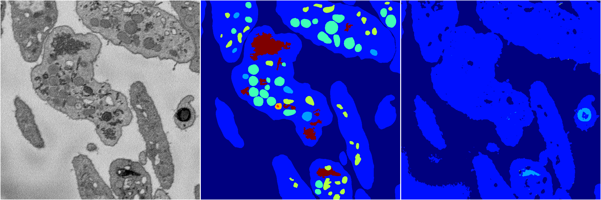
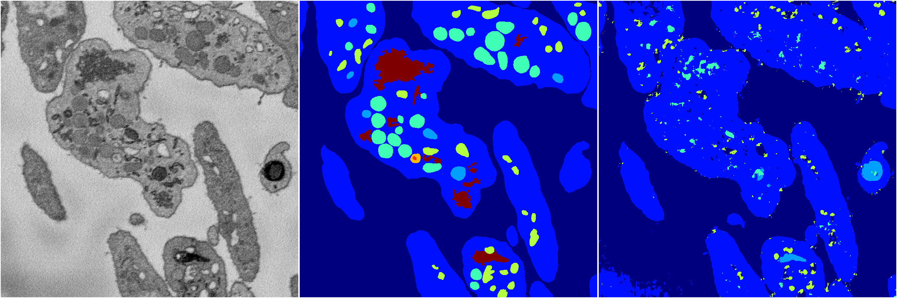
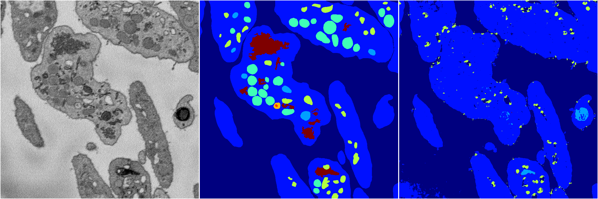
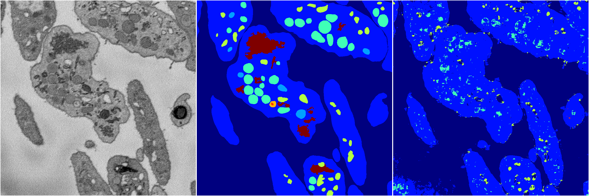

[Back](..)&nbsp;&nbsp;&nbsp;&nbsp;&nbsp;[Home](https://leapmanlab.github.io/snapshots)

---

<a href="2"><h2>random_2d_ed / 1216 / 5 / 2</h2></a>
Created 21 Dec 2018, 14:17:41

<i>Click for more details</i>

**ari**: 0.5933. **miou**: 0.2061. **accuracy**: 0.8320. **n_params**: 557141.0000. 

---

<a href="3"><h2>random_2d_ed / 1216 / 5 / 3</h2></a>
Created 21 Dec 2018, 14:17:41

<i>Click for more details</i>

**ari**: 0.6629. **miou**: 0.2962. **accuracy**: 0.8423. **n_params**: 557141.0000. 

---

<a href="1"><h2>random_2d_ed / 1216 / 5 / 1</h2></a>
Created 21 Dec 2018, 14:17:41

<i>Click for more details</i>

**ari**: 0.6696. **miou**: 0.2695. **accuracy**: 0.8481. **n_params**: 557141.0000. 

---

<a href="4"><h2>random_2d_ed / 1216 / 5 / 4</h2></a>
Created 21 Dec 2018, 14:17:41

<i>Click for more details</i>

**ari**: 0.6424. **miou**: 0.2565. **accuracy**: 0.8470. **n_params**: 557141.0000. 

---

<a href="0"><h2>random_2d_ed / 1216 / 5 / 0</h2></a>
Created 21 Dec 2018, 14:17:41

<i>Click for more details</i>

**ari**: 0.6498. **miou**: 0.2687. **accuracy**: 0.8444. **n_params**: 557141.0000. 

---

[Back](..)&nbsp;&nbsp;&nbsp;&nbsp;&nbsp;[Home](https://leapmanlab.github.io/snapshots)

---