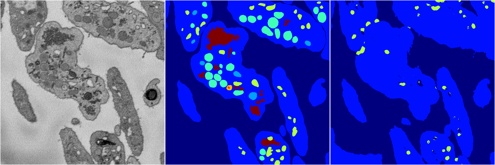
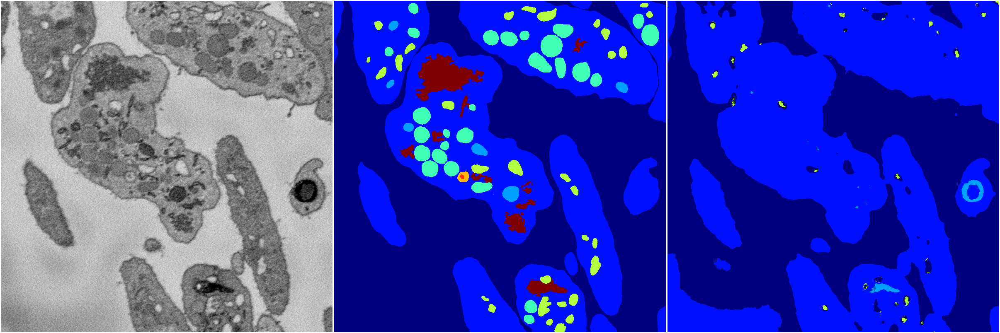
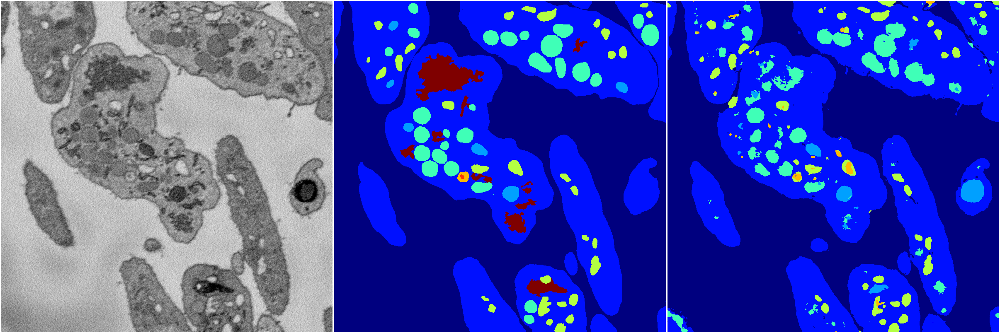
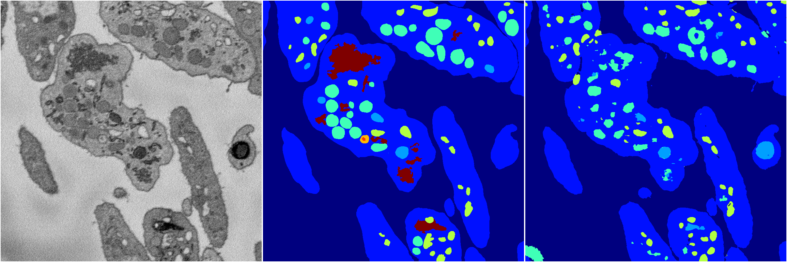

[Back](..)&nbsp;&nbsp;&nbsp;&nbsp;&nbsp;[Home](https://leapmanlab.github.io/snapshots)

---

<a href="4"><h2>random_2d_ed / 1216 / 50 / 4</h2></a>
Created 17 Dec 2018, 02:57:41

<i>Click for more details</i>

**ari**: 0.6535. **miou**: 0.2437. **accuracy**: 0.8583. **n_params**: 807571.0000. 

---

<a href="3"><h2>random_2d_ed / 1216 / 50 / 3</h2></a>
Created 17 Dec 2018, 02:57:41

<i>Click for more details</i>

**ari**: 0.6290. **miou**: 0.2191. **accuracy**: 0.8489. **n_params**: 807571.0000. 

---

<a href="1"><h2>random_2d_ed / 1216 / 50 / 1</h2></a>
Created 17 Dec 2018, 02:57:41

<i>Click for more details</i>

**ari**: 0.7598. **miou**: 0.4736. **accuracy**: 0.8884. **n_params**: 807571.0000. 

---

<a href="2"><h2>random_2d_ed / 1216 / 50 / 2</h2></a>
Created 17 Dec 2018, 02:57:41

<i>Click for more details</i>

**ari**: 0.7809. **miou**: 0.4198. **accuracy**: 0.8981. **n_params**: 807571.0000. 

---

<a href="0"><h2>random_2d_ed / 1216 / 50 / 0</h2></a>
Created 17 Dec 2018, 02:57:41

<i>Click for more details</i>

**ari**: 0.7729. **miou**: 0.3871. **accuracy**: 0.8951. **n_params**: 807571.0000. 

---

[Back](..)&nbsp;&nbsp;&nbsp;&nbsp;&nbsp;[Home](https://leapmanlab.github.io/snapshots)

---