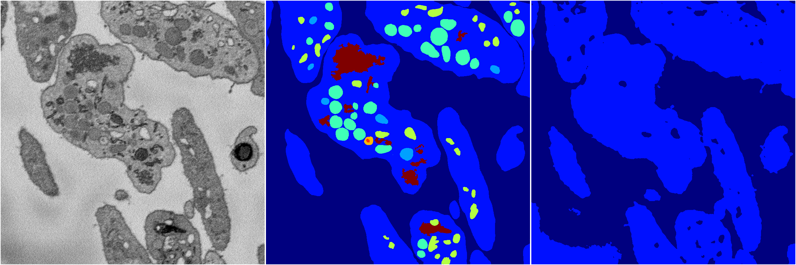
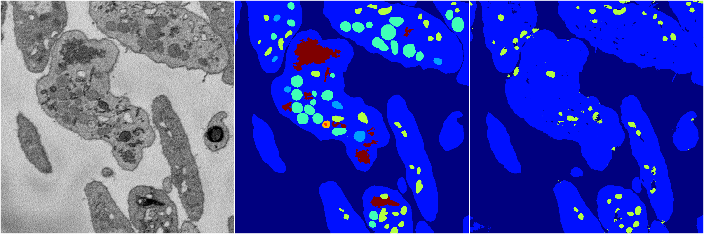
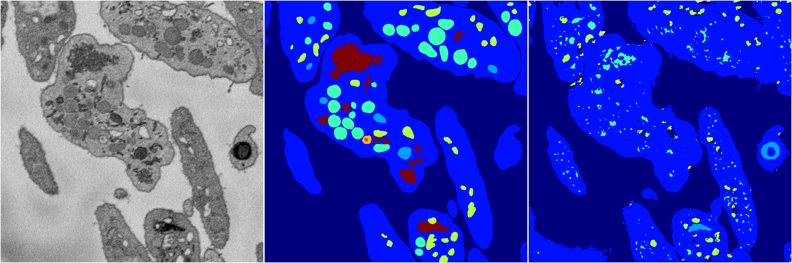

[Back](..)&nbsp;&nbsp;&nbsp;&nbsp;&nbsp;[Home](https://leapmanlab.github.io/snapshots)

---

<a href="4"><h2>random_2d_ed / 1216 / 51 / 4</h2></a>
Created 21 Dec 2018, 14:17:43

<i>Click for more details</i>

**ari**: 0.6282. **miou**: 0.2094. **accuracy**: 0.8435. **n_params**: 334112.0000. 

---

<a href="2"><h2>random_2d_ed / 1216 / 51 / 2</h2></a>
Created 21 Dec 2018, 14:17:42

<i>Click for more details</i>

**ari**: 0.6081. **miou**: 0.2029. **accuracy**: 0.8391. **n_params**: 334112.0000. 

---

<a href="3"><h2>random_2d_ed / 1216 / 51 / 3</h2></a>
Created 21 Dec 2018, 14:17:42

<i>Click for more details</i>

**ari**: 0.6946. **miou**: 0.2947. **accuracy**: 0.8613. **n_params**: 334112.0000. 

---

<a href="1"><h2>random_2d_ed / 1216 / 51 / 1</h2></a>
Created 21 Dec 2018, 14:17:42

<i>Click for more details</i>

**ari**: 0.6852. **miou**: 0.2746. **accuracy**: 0.8650. **n_params**: 334112.0000. 

---

<a href="0"><h2>random_2d_ed / 1216 / 51 / 0</h2></a>
Created 21 Dec 2018, 14:17:42

<i>Click for more details</i>

**ari**: 0.6601. **miou**: 0.2616. **accuracy**: 0.8481. **n_params**: 334112.0000. 

---

[Back](..)&nbsp;&nbsp;&nbsp;&nbsp;&nbsp;[Home](https://leapmanlab.github.io/snapshots)

---