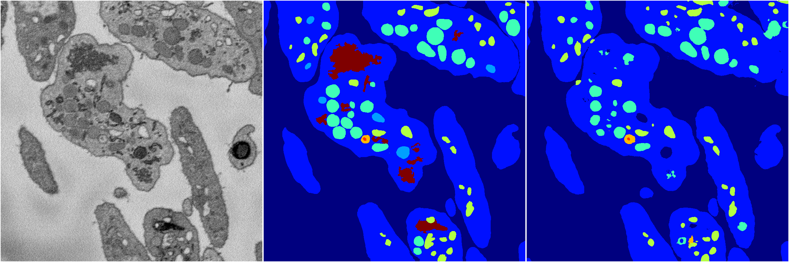
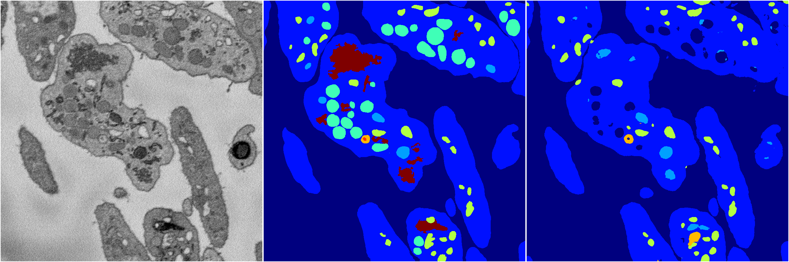
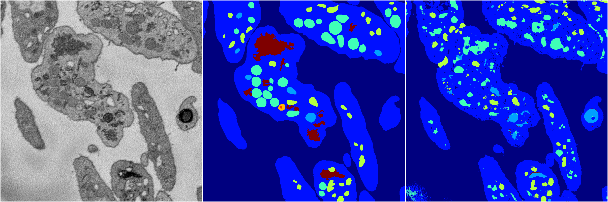
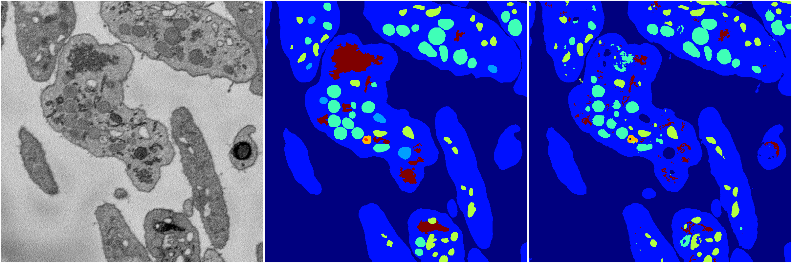

[Back](..)&nbsp;&nbsp;&nbsp;&nbsp;&nbsp;[Home](https://leapmanlab.github.io/snapshots)

---

<a href="4"><h2>random_2d_ed / 1216 / 52 / 4</h2></a>
Created 17 Dec 2018, 02:57:40

<i>Click for more details</i>

**ari**: 0.8160. **miou**: 0.5596. **accuracy**: 0.9216. **n_params**: 7276783.0000. 

---

<a href="2"><h2>random_2d_ed / 1216 / 52 / 2</h2></a>
Created 17 Dec 2018, 02:57:40

<i>Click for more details</i>

**ari**: 0.7999. **miou**: 0.4691. **accuracy**: 0.9133. **n_params**: 7276783.0000. 

---

<a href="3"><h2>random_2d_ed / 1216 / 52 / 3</h2></a>
Created 17 Dec 2018, 02:57:40

<i>Click for more details</i>

**ari**: 0.7868. **miou**: 0.4048. **accuracy**: 0.9078. **n_params**: 7276783.0000. 

---

<a href="1"><h2>random_2d_ed / 1216 / 52 / 1</h2></a>
Created 17 Dec 2018, 02:57:40

<i>Click for more details</i>

**ari**: 0.7326. **miou**: 0.3461. **accuracy**: 0.8770. **n_params**: 7276783.0000. 

---

<a href="0"><h2>random_2d_ed / 1216 / 52 / 0</h2></a>
Created 17 Dec 2018, 02:57:40

<i>Click for more details</i>

**ari**: 0.7995. **miou**: 0.4399. **accuracy**: 0.9138. **n_params**: 7276783.0000. 

---

[Back](..)&nbsp;&nbsp;&nbsp;&nbsp;&nbsp;[Home](https://leapmanlab.github.io/snapshots)

---