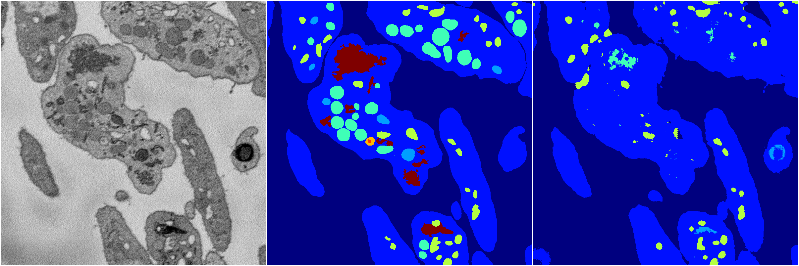
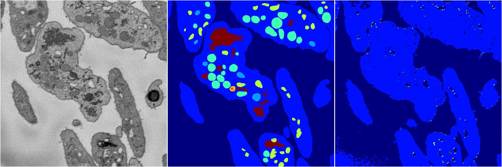
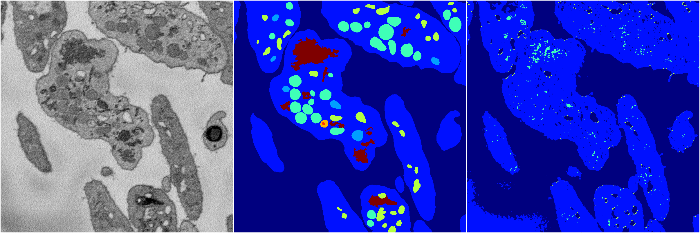
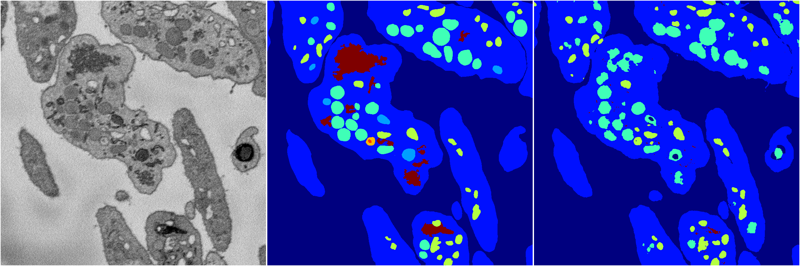

[Back](..)&nbsp;&nbsp;&nbsp;&nbsp;&nbsp;[Home](https://leapmanlab.github.io/snapshots)

---

<a href="4"><h2>random_2d_ed / 1216 / 53 / 4</h2></a>
Created 17 Dec 2018, 02:57:41

<i>Click for more details</i>

**ari**: 0.5804. **miou**: 0.2850. **accuracy**: 0.8776. **n_params**: 98298755.0000. 

---

<a href="3"><h2>random_2d_ed / 1216 / 53 / 3</h2></a>
Created 17 Dec 2018, 02:57:41

<i>Click for more details</i>

**ari**: 0.4750. **miou**: 0.2111. **accuracy**: 0.8513. **n_params**: 98298755.0000. 

---

<a href="2"><h2>random_2d_ed / 1216 / 53 / 2</h2></a>
Created 17 Dec 2018, 02:57:41

<i>Click for more details</i>

**ari**: 0.4975. **miou**: 0.2130. **accuracy**: 0.8426. **n_params**: 98298755.0000. 

---

<a href="1"><h2>random_2d_ed / 1216 / 53 / 1</h2></a>
Created 17 Dec 2018, 02:57:41

<i>Click for more details</i>

**ari**: 0.6906. **miou**: 0.3516. **accuracy**: 0.9026. **n_params**: 98298755.0000. 

---

<a href="0"><h2>random_2d_ed / 1216 / 53 / 0</h2></a>
Created 17 Dec 2018, 02:57:41

<i>Click for more details</i>

**ari**: 0.6901. **miou**: 0.3893. **accuracy**: 0.9058. **n_params**: 98298755.0000. 

---

[Back](..)&nbsp;&nbsp;&nbsp;&nbsp;&nbsp;[Home](https://leapmanlab.github.io/snapshots)

---