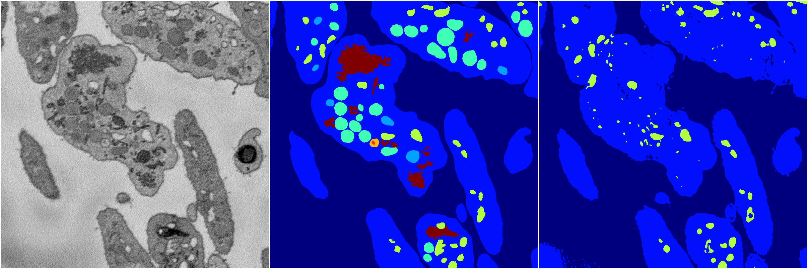
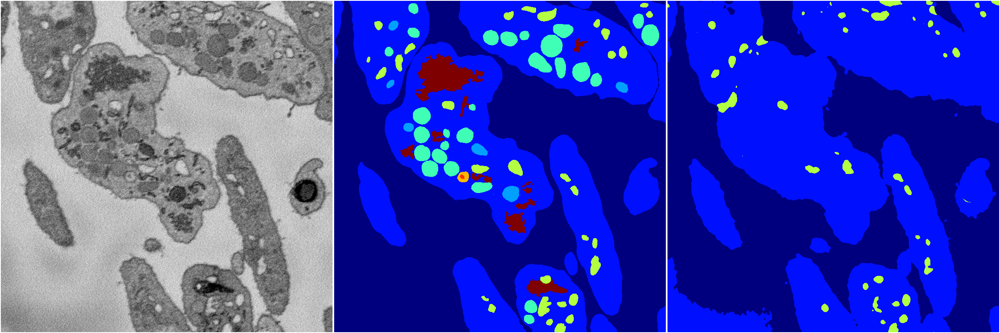
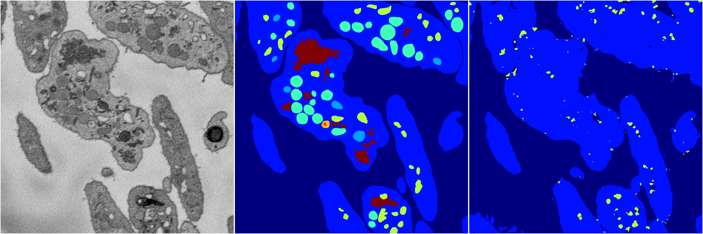
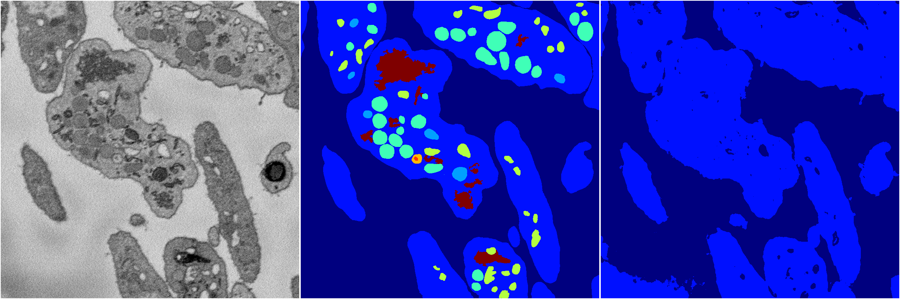
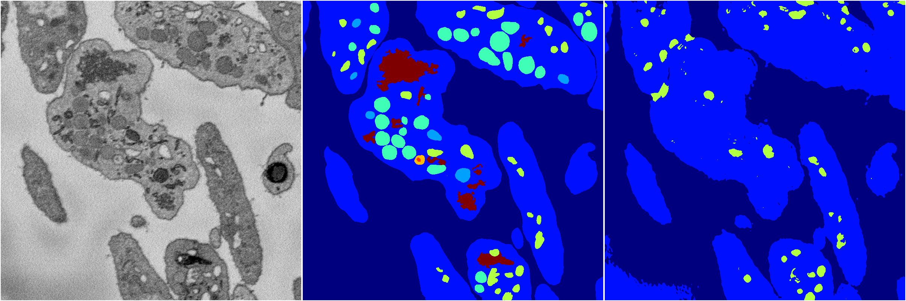

[Back](..)&nbsp;&nbsp;&nbsp;&nbsp;&nbsp;[Home](https://leapmanlab.github.io/snapshots)

---

<a href="4"><h2>random_2d_ed / 1216 / 54 / 4</h2></a>
Created 17 Dec 2018, 02:57:41

<i>Click for more details</i>

**ari**: 0.5348. **miou**: 0.2708. **accuracy**: 0.8658. **n_params**: 8115127.0000. 

---

<a href="3"><h2>random_2d_ed / 1216 / 54 / 3</h2></a>
Created 17 Dec 2018, 02:57:41

<i>Click for more details</i>

**ari**: 0.5211. **miou**: 0.2614. **accuracy**: 0.8607. **n_params**: 8115127.0000. 

---

<a href="2"><h2>random_2d_ed / 1216 / 54 / 2</h2></a>
Created 17 Dec 2018, 02:57:41

<i>Click for more details</i>

**ari**: 0.5261. **miou**: 0.2466. **accuracy**: 0.8669. **n_params**: 8115127.0000. 

---

<a href="1"><h2>random_2d_ed / 1216 / 54 / 1</h2></a>
Created 17 Dec 2018, 02:57:41

<i>Click for more details</i>

**ari**: 0.4919. **miou**: 0.2029. **accuracy**: 0.8494. **n_params**: 8115127.0000. 

---

<a href="0"><h2>random_2d_ed / 1216 / 54 / 0</h2></a>
Created 17 Dec 2018, 02:57:41

<i>Click for more details</i>

**ari**: 0.5489. **miou**: 0.2692. **accuracy**: 0.8688. **n_params**: 8115127.0000. 

---

[Back](..)&nbsp;&nbsp;&nbsp;&nbsp;&nbsp;[Home](https://leapmanlab.github.io/snapshots)

---