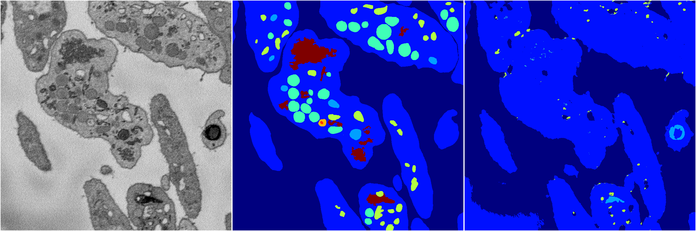
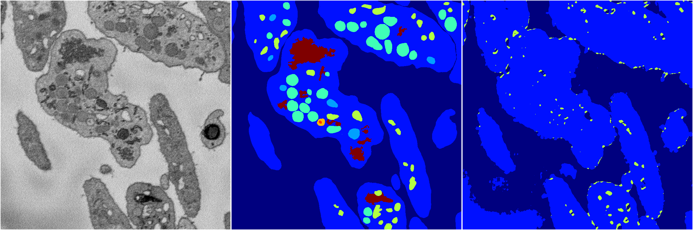
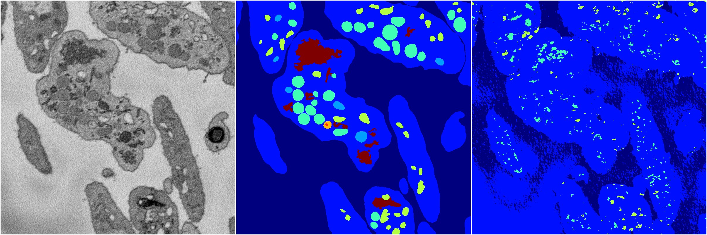
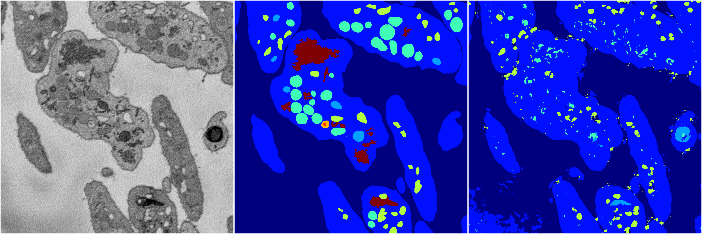

[Back](..)&nbsp;&nbsp;&nbsp;&nbsp;&nbsp;[Home](https://leapmanlab.github.io/snapshots)

---

<a href="0"><h2>random_2d_ed / 1216 / 55 / 0</h2></a>
Created 21 Dec 2018, 01:15:55

<i>Click for more details</i>

**ari**: 0.6055. **miou**: 0.2146. **accuracy**: 0.8372. **n_params**: 40497.0000. 

---

<a href="3"><h2>random_2d_ed / 1216 / 55 / 3</h2></a>
Created 21 Dec 2018, 01:15:55

<i>Click for more details</i>

**ari**: 0.5300. **miou**: 0.2210. **accuracy**: 0.8160. **n_params**: 40497.0000. 

---

<a href="1"><h2>random_2d_ed / 1216 / 55 / 1</h2></a>
Created 21 Dec 2018, 01:15:55

<i>Click for more details</i>

**ari**: 0.2263. **miou**: 0.1714. **accuracy**: 0.6827. **n_params**: 40497.0000. 

---

<a href="4"><h2>random_2d_ed / 1216 / 55 / 4</h2></a>
Created 21 Dec 2018, 01:15:55

<i>Click for more details</i>

**ari**: 0.6717. **miou**: 0.2915. **accuracy**: 0.8592. **n_params**: 40497.0000. 

---

<a href="2"><h2>random_2d_ed / 1216 / 55 / 2</h2></a>
Created 21 Dec 2018, 01:15:55

<i>Click for more details</i>

**ari**: 0.6447. **miou**: 0.2818. **accuracy**: 0.8449. **n_params**: 40497.0000. 

---

[Back](..)&nbsp;&nbsp;&nbsp;&nbsp;&nbsp;[Home](https://leapmanlab.github.io/snapshots)

---