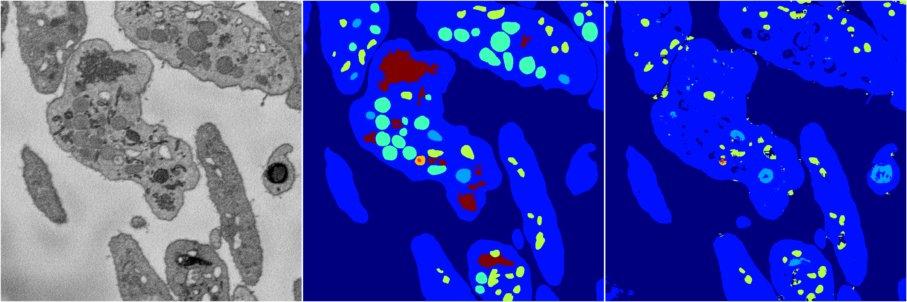
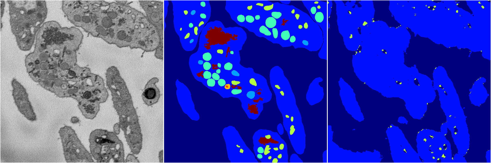
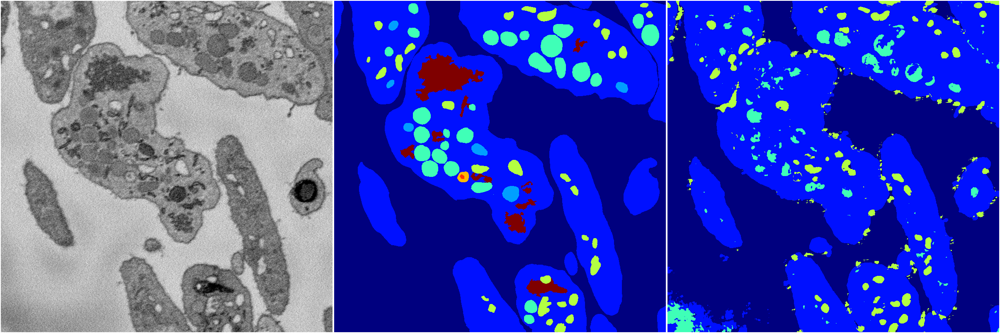

[Back](..)&nbsp;&nbsp;&nbsp;&nbsp;&nbsp;[Home](https://leapmanlab.github.io/snapshots)

---

<a href="4"><h2>random_2d_ed / 1216 / 56 / 4</h2></a>
Created 21 Dec 2018, 14:17:44

<i>Click for more details</i>

**ari**: 0.7114. **miou**: 0.3824. **accuracy**: 0.8726. **n_params**: 1127592.0000. 

---

<a href="3"><h2>random_2d_ed / 1216 / 56 / 3</h2></a>
Created 21 Dec 2018, 14:17:44

<i>Click for more details</i>

**ari**: 0.6196. **miou**: 0.2222. **accuracy**: 0.8429. **n_params**: 1127592.0000. 

---

<a href="2"><h2>random_2d_ed / 1216 / 56 / 2</h2></a>
Created 21 Dec 2018, 14:17:44

<i>Click for more details</i>

**ari**: 0.7345. **miou**: 0.3913. **accuracy**: 0.8769. **n_params**: 1127592.0000. 

---

<a href="1"><h2>random_2d_ed / 1216 / 56 / 1</h2></a>
Created 21 Dec 2018, 14:17:44

<i>Click for more details</i>

**ari**: 0.6654. **miou**: 0.2770. **accuracy**: 0.8450. **n_params**: 1127592.0000. 

---

<a href="0"><h2>random_2d_ed / 1216 / 56 / 0</h2></a>
Created 21 Dec 2018, 14:17:44

<i>Click for more details</i>

**ari**: 0.6106. **miou**: 0.2756. **accuracy**: 0.8332. **n_params**: 1127592.0000. 

---

[Back](..)&nbsp;&nbsp;&nbsp;&nbsp;&nbsp;[Home](https://leapmanlab.github.io/snapshots)

---