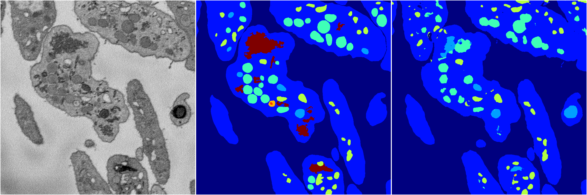
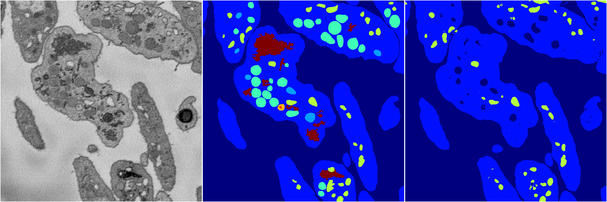
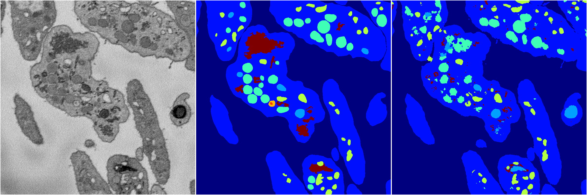

[Back](..)&nbsp;&nbsp;&nbsp;&nbsp;&nbsp;[Home](https://leapmanlab.github.io/snapshots)

---

<a href="4"><h2>random_2d_ed / 1216 / 57 / 4</h2></a>
Created 21 Dec 2018, 14:17:44

<i>Click for more details</i>

**ari**: 0.7976. **miou**: 0.4579. **accuracy**: 0.9159. **n_params**: 1814012.0000. 

---

<a href="3"><h2>random_2d_ed / 1216 / 57 / 3</h2></a>
Created 21 Dec 2018, 14:17:44

<i>Click for more details</i>

**ari**: 0.7990. **miou**: 0.4031. **accuracy**: 0.9122. **n_params**: 1814012.0000. 

---

<a href="2"><h2>random_2d_ed / 1216 / 57 / 2</h2></a>
Created 21 Dec 2018, 14:17:44

<i>Click for more details</i>

**ari**: 0.7999. **miou**: 0.4014. **accuracy**: 0.9126. **n_params**: 1814012.0000. 

---

<a href="1"><h2>random_2d_ed / 1216 / 57 / 1</h2></a>
Created 21 Dec 2018, 14:17:44

<i>Click for more details</i>

**ari**: 0.7582. **miou**: 0.2993. **accuracy**: 0.9003. **n_params**: 1814012.0000. 

---

<a href="0"><h2>random_2d_ed / 1216 / 57 / 0</h2></a>
Created 21 Dec 2018, 14:17:44

<i>Click for more details</i>

**ari**: 0.7915. **miou**: 0.4073. **accuracy**: 0.9078. **n_params**: 1814012.0000. 

---

[Back](..)&nbsp;&nbsp;&nbsp;&nbsp;&nbsp;[Home](https://leapmanlab.github.io/snapshots)

---