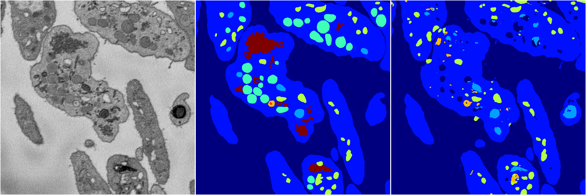
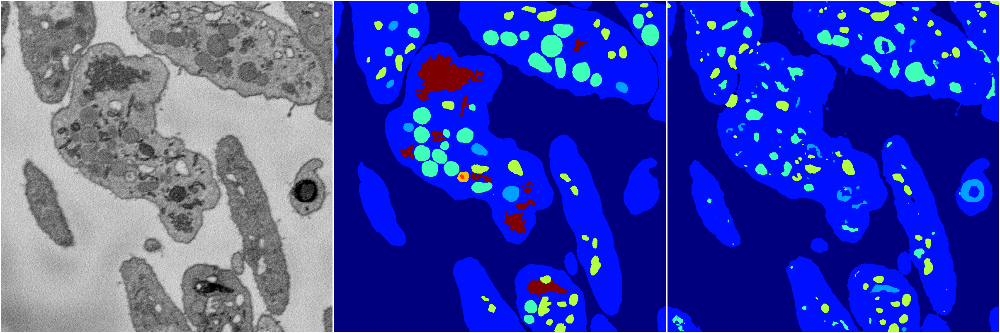

[Back](..)&nbsp;&nbsp;&nbsp;&nbsp;&nbsp;[Home](https://leapmanlab.github.io/snapshots)

---

<a href="0"><h2>random_2d_ed / 1216 / 58 / 0</h2></a>
Created 21 Dec 2018, 01:15:55

<i>Click for more details</i>

**ari**: 0.8218. **miou**: 0.5645. **accuracy**: 0.9240. **n_params**: 4069783.0000. 

---

<a href="3"><h2>random_2d_ed / 1216 / 58 / 3</h2></a>
Created 21 Dec 2018, 01:15:55

<i>Click for more details</i>

**ari**: 0.7974. **miou**: 0.3825. **accuracy**: 0.9028. **n_params**: 4069783.0000. 

---

<a href="1"><h2>random_2d_ed / 1216 / 58 / 1</h2></a>
Created 21 Dec 2018, 01:15:55

<i>Click for more details</i>

**ari**: 0.7877. **miou**: 0.3854. **accuracy**: 0.9042. **n_params**: 4069783.0000. 

---

<a href="4"><h2>random_2d_ed / 1216 / 58 / 4</h2></a>
Created 21 Dec 2018, 01:15:55

<i>Click for more details</i>

**ari**: 0.7619. **miou**: 0.3952. **accuracy**: 0.8979. **n_params**: 4069783.0000. 

---

<a href="2"><h2>random_2d_ed / 1216 / 58 / 2</h2></a>
Created 21 Dec 2018, 01:15:55

<i>Click for more details</i>

**ari**: 0.7839. **miou**: 0.3973. **accuracy**: 0.9058. **n_params**: 4069783.0000. 

---

[Back](..)&nbsp;&nbsp;&nbsp;&nbsp;&nbsp;[Home](https://leapmanlab.github.io/snapshots)

---