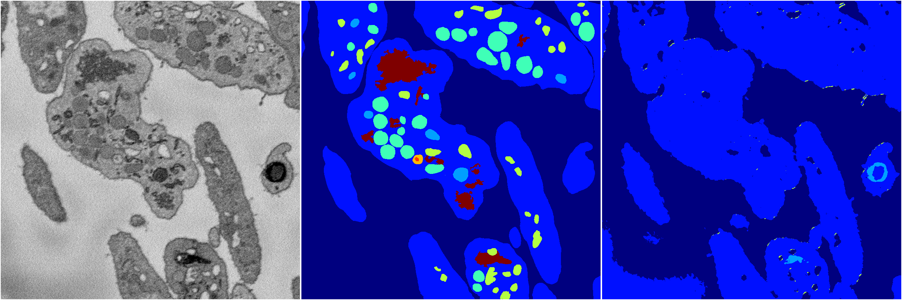
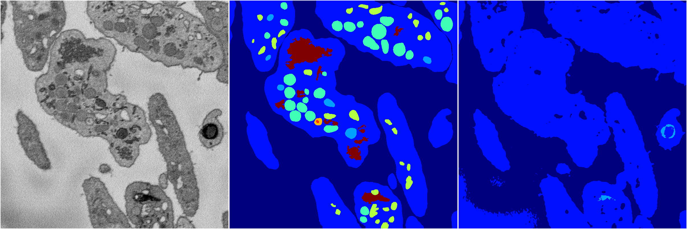
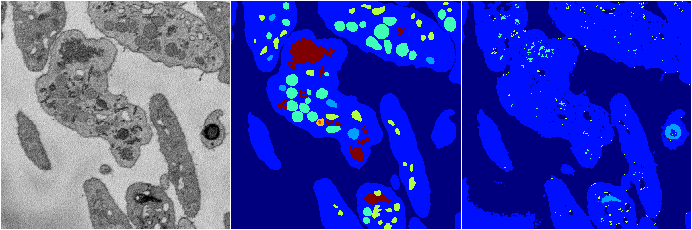

[Back](..)&nbsp;&nbsp;&nbsp;&nbsp;&nbsp;[Home](https://leapmanlab.github.io/snapshots)

---

<a href="0"><h2>random_2d_ed / 1216 / 6 / 0</h2></a>
Created 21 Dec 2018, 01:15:55

<i>Click for more details</i>

**ari**: 0.5932. **miou**: 0.2037. **accuracy**: 0.8326. **n_params**: 197039.0000. 

---

<a href="3"><h2>random_2d_ed / 1216 / 6 / 3</h2></a>
Created 21 Dec 2018, 01:15:55

<i>Click for more details</i>

**ari**: 0.6301. **miou**: 0.2358. **accuracy**: 0.8420. **n_params**: 197039.0000. 

---

<a href="1"><h2>random_2d_ed / 1216 / 6 / 1</h2></a>
Created 21 Dec 2018, 01:15:55

<i>Click for more details</i>

**ari**: 0.5783. **miou**: 0.2004. **accuracy**: 0.8297. **n_params**: 197039.0000. 

---

<a href="4"><h2>random_2d_ed / 1216 / 6 / 4</h2></a>
Created 21 Dec 2018, 01:15:55

<i>Click for more details</i>

**ari**: 0.6171. **miou**: 0.2165. **accuracy**: 0.8344. **n_params**: 197039.0000. 

---

<a href="2"><h2>random_2d_ed / 1216 / 6 / 2</h2></a>
Created 21 Dec 2018, 01:15:55

<i>Click for more details</i>

**ari**: 0.5762. **miou**: 0.1997. **accuracy**: 0.8295. **n_params**: 197039.0000. 

---

[Back](..)&nbsp;&nbsp;&nbsp;&nbsp;&nbsp;[Home](https://leapmanlab.github.io/snapshots)

---