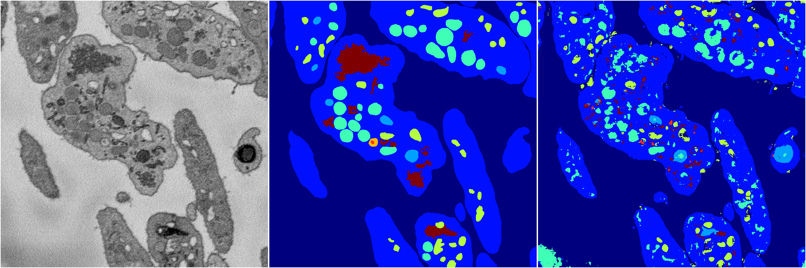
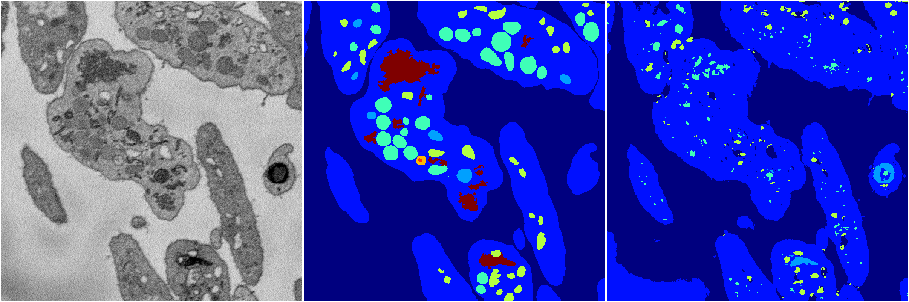
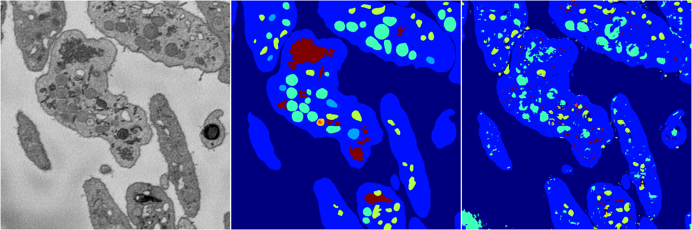
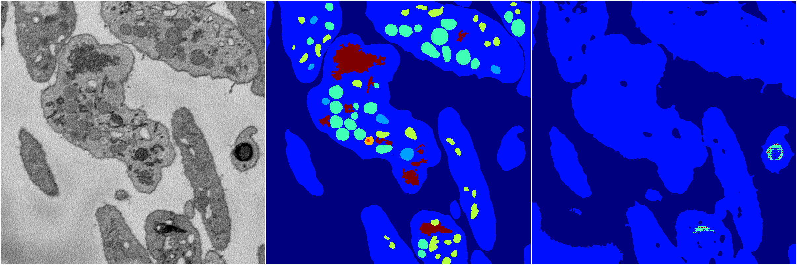

[Back](..)&nbsp;&nbsp;&nbsp;&nbsp;&nbsp;[Home](https://leapmanlab.github.io/snapshots)

---

<a href="3"><h2>random_2d_ed / 1216 / 60 / 3</h2></a>
Created 17 Dec 2018, 23:35:12

<i>Click for more details</i>

**ari**: 0.7255. **miou**: 0.3942. **accuracy**: 0.8685. **n_params**: 585512.0000. 

---

<a href="4"><h2>random_2d_ed / 1216 / 60 / 4</h2></a>
Created 17 Dec 2018, 23:35:12

<i>Click for more details</i>

**ari**: 0.7213. **miou**: 0.3958. **accuracy**: 0.8674. **n_params**: 585512.0000. 

---

<a href="2"><h2>random_2d_ed / 1216 / 60 / 2</h2></a>
Created 17 Dec 2018, 23:35:12

<i>Click for more details</i>

**ari**: 0.6405. **miou**: 0.2509. **accuracy**: 0.8401. **n_params**: 585512.0000. 

---

<a href="1"><h2>random_2d_ed / 1216 / 60 / 1</h2></a>
Created 17 Dec 2018, 23:35:12

<i>Click for more details</i>

**ari**: 0.7166. **miou**: 0.3539. **accuracy**: 0.8639. **n_params**: 585512.0000. 

---

<a href="0"><h2>random_2d_ed / 1216 / 60 / 0</h2></a>
Created 17 Dec 2018, 23:35:12

<i>Click for more details</i>

**ari**: 0.5954. **miou**: 0.2019. **accuracy**: 0.8351. **n_params**: 585512.0000. 

---

[Back](..)&nbsp;&nbsp;&nbsp;&nbsp;&nbsp;[Home](https://leapmanlab.github.io/snapshots)

---