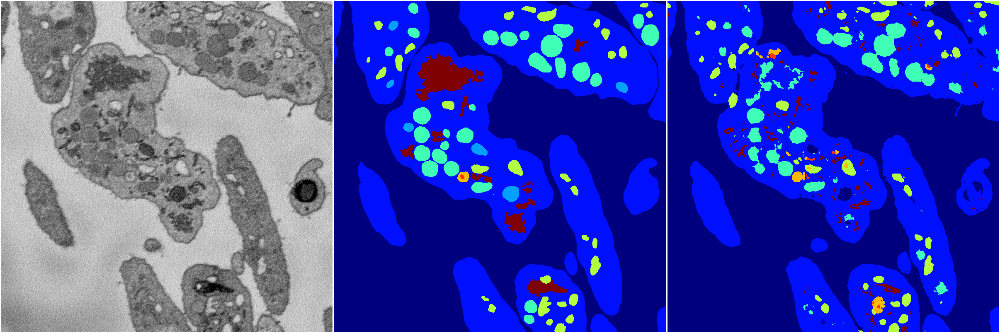
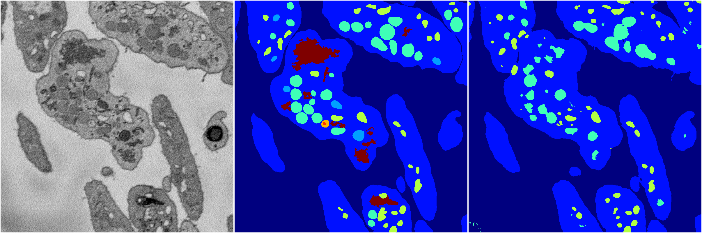
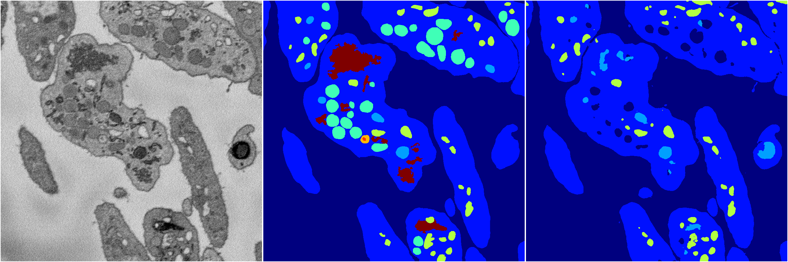
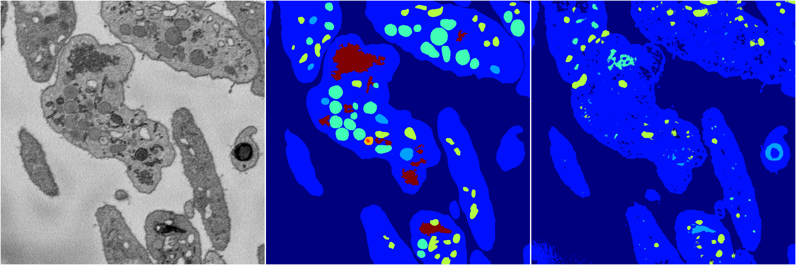

[Back](..)&nbsp;&nbsp;&nbsp;&nbsp;&nbsp;[Home](https://leapmanlab.github.io/snapshots)

---

<a href="3"><h2>random_2d_ed / 1216 / 61 / 3</h2></a>
Created 17 Dec 2018, 02:57:42

<i>Click for more details</i>

**ari**: 0.7186. **miou**: 0.2905. **accuracy**: 0.8776. **n_params**: 12713131.0000. 

---

<a href="2"><h2>random_2d_ed / 1216 / 61 / 2</h2></a>
Created 17 Dec 2018, 02:57:42

<i>Click for more details</i>

**ari**: 0.7369. **miou**: 0.2962. **accuracy**: 0.8898. **n_params**: 12713131.0000. 

---

<a href="1"><h2>random_2d_ed / 1216 / 61 / 1</h2></a>
Created 17 Dec 2018, 02:57:42

<i>Click for more details</i>

**ari**: 0.7748. **miou**: 0.3497. **accuracy**: 0.9033. **n_params**: 12713131.0000. 

---

<a href="0"><h2>random_2d_ed / 1216 / 61 / 0</h2></a>
Created 17 Dec 2018, 02:57:42

<i>Click for more details</i>

**ari**: 0.6400. **miou**: 0.2037. **accuracy**: 0.8574. **n_params**: 12713131.0000. 

---

[Back](..)&nbsp;&nbsp;&nbsp;&nbsp;&nbsp;[Home](https://leapmanlab.github.io/snapshots)

---