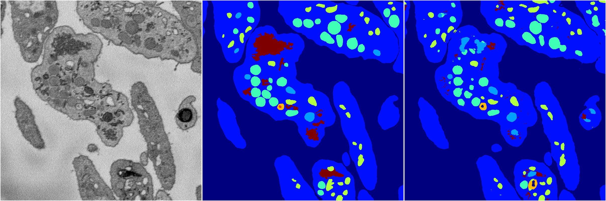
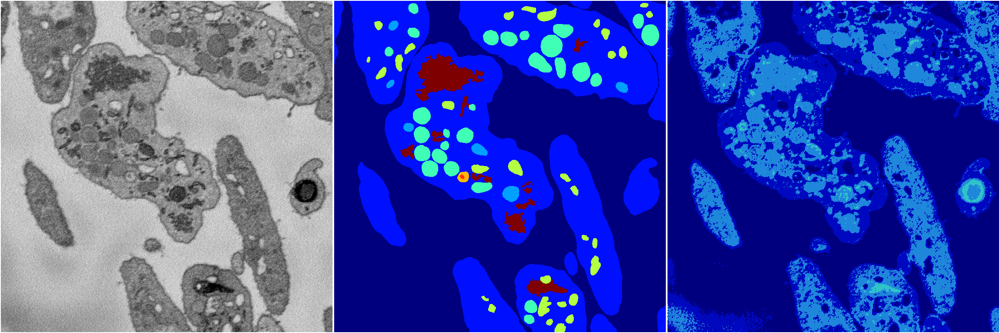
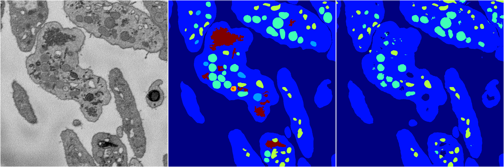

[Back](..)&nbsp;&nbsp;&nbsp;&nbsp;&nbsp;[Home](https://leapmanlab.github.io/snapshots)

---

<a href="4"><h2>random_2d_ed / 1216 / 62 / 4</h2></a>
Created 17 Dec 2018, 23:35:13

<i>Click for more details</i>

**ari**: 0.8208. **miou**: 0.4948. **accuracy**: 0.9223. **n_params**: 2830694.0000. 

---

<a href="2"><h2>random_2d_ed / 1216 / 62 / 2</h2></a>
Created 17 Dec 2018, 23:35:13

<i>Click for more details</i>

**ari**: 0.8182. **miou**: 0.5439. **accuracy**: 0.9202. **n_params**: 2830694.0000. 

---

<a href="3"><h2>random_2d_ed / 1216 / 62 / 3</h2></a>
Created 17 Dec 2018, 23:35:13

<i>Click for more details</i>

**ari**: 0.3626. **miou**: 0.1535. **accuracy**: 0.6756. **n_params**: 2830694.0000. 

---

<a href="1"><h2>random_2d_ed / 1216 / 62 / 1</h2></a>
Created 17 Dec 2018, 23:35:13

<i>Click for more details</i>

**ari**: 0.7940. **miou**: 0.3641. **accuracy**: 0.9105. **n_params**: 2830694.0000. 

---

<a href="0"><h2>random_2d_ed / 1216 / 62 / 0</h2></a>
Created 17 Dec 2018, 23:35:13

<i>Click for more details</i>

**ari**: 0.4979. **miou**: 0.1870. **accuracy**: 0.7714. **n_params**: 2830694.0000. 

---

[Back](..)&nbsp;&nbsp;&nbsp;&nbsp;&nbsp;[Home](https://leapmanlab.github.io/snapshots)

---