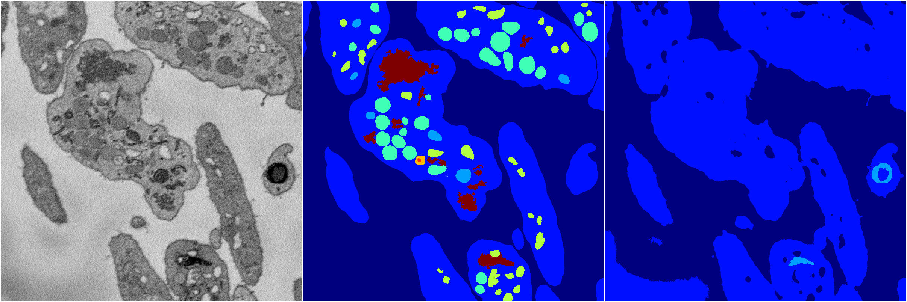
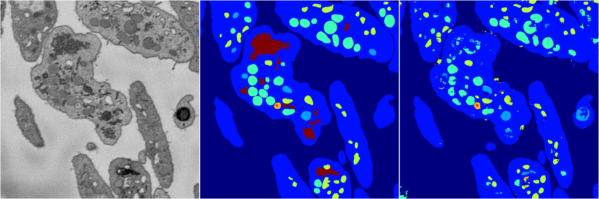
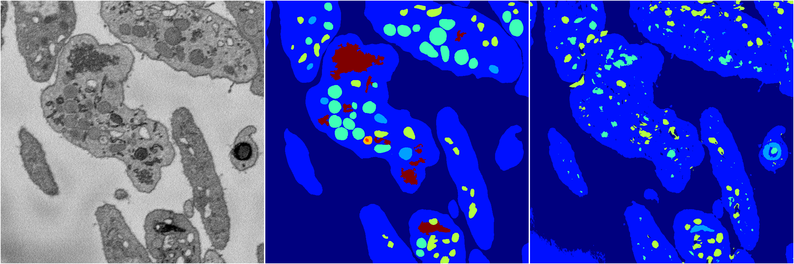
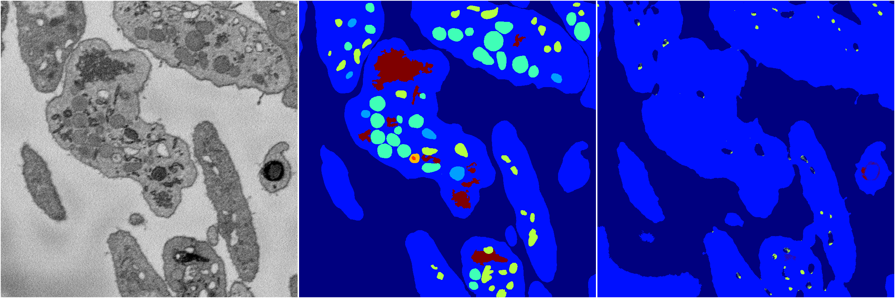

[Back](..)&nbsp;&nbsp;&nbsp;&nbsp;&nbsp;[Home](https://leapmanlab.github.io/snapshots)

---

<a href="4"><h2>random_2d_ed / 1216 / 63 / 4</h2></a>
Created 17 Dec 2018, 23:35:13

<i>Click for more details</i>

**ari**: 0.6178. **miou**: 0.2068. **accuracy**: 0.8418. **n_params**: 1427077.0000. 

---

<a href="3"><h2>random_2d_ed / 1216 / 63 / 3</h2></a>
Created 17 Dec 2018, 23:35:13

<i>Click for more details</i>

**ari**: 0.7770. **miou**: 0.4834. **accuracy**: 0.8991. **n_params**: 1427077.0000. 

---

<a href="2"><h2>random_2d_ed / 1216 / 63 / 2</h2></a>
Created 17 Dec 2018, 23:35:13

<i>Click for more details</i>

**ari**: 0.7783. **miou**: 0.4996. **accuracy**: 0.9011. **n_params**: 1427077.0000. 

---

<a href="1"><h2>random_2d_ed / 1216 / 63 / 1</h2></a>
Created 17 Dec 2018, 23:35:13

<i>Click for more details</i>

**ari**: 0.6745. **miou**: 0.2811. **accuracy**: 0.8515. **n_params**: 1427077.0000. 

---

<a href="0"><h2>random_2d_ed / 1216 / 63 / 0</h2></a>
Created 17 Dec 2018, 23:35:13

<i>Click for more details</i>

**ari**: 0.6098. **miou**: 0.2137. **accuracy**: 0.8418. **n_params**: 1427077.0000. 

---

[Back](..)&nbsp;&nbsp;&nbsp;&nbsp;&nbsp;[Home](https://leapmanlab.github.io/snapshots)

---