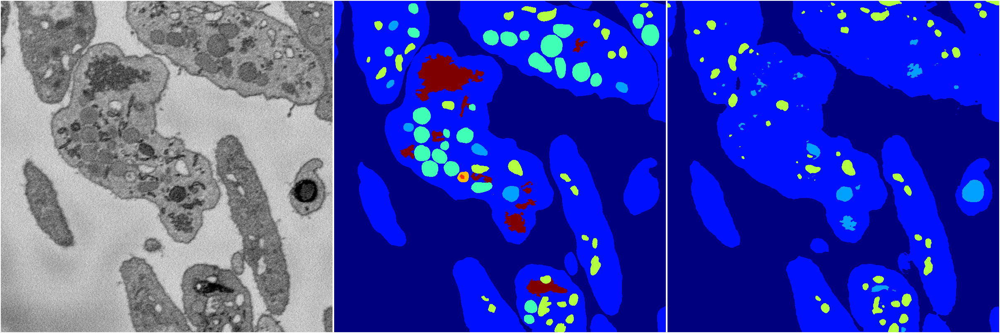
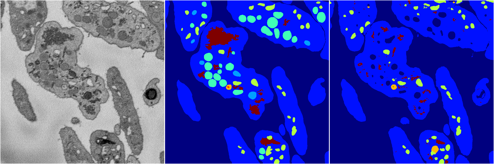
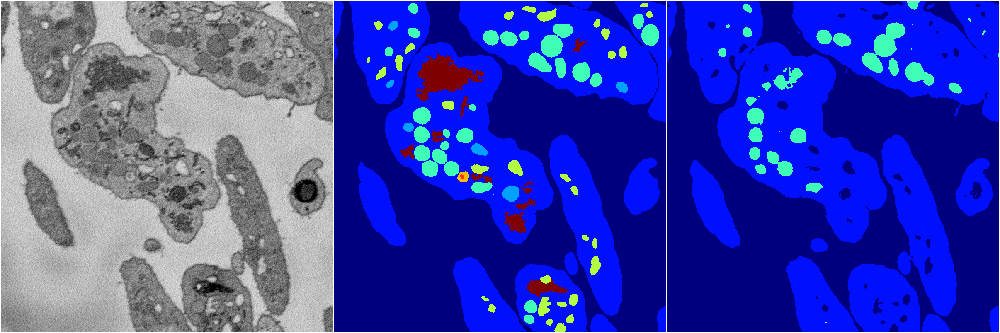
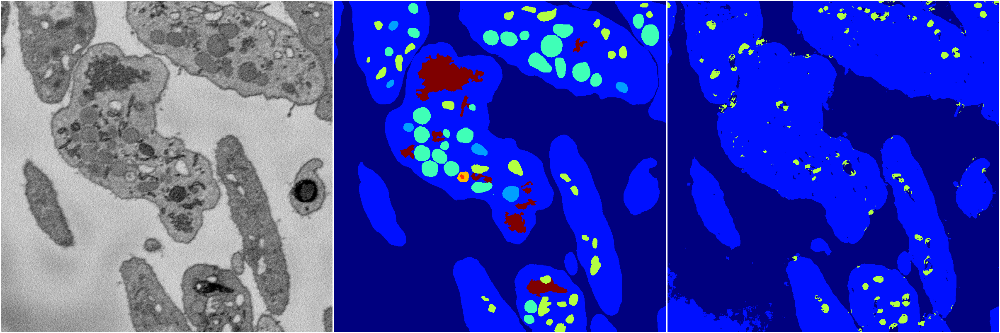

[Back](..)&nbsp;&nbsp;&nbsp;&nbsp;&nbsp;[Home](https://leapmanlab.github.io/snapshots)

---

<a href="4"><h2>random_2d_ed / 1216 / 64 / 4</h2></a>
Created 21 Dec 2018, 14:17:44

<i>Click for more details</i>

**ari**: 0.7539. **miou**: 0.3345. **accuracy**: 0.8995. **n_params**: 2988905.0000. 

---

<a href="3"><h2>random_2d_ed / 1216 / 64 / 3</h2></a>
Created 21 Dec 2018, 14:17:44

<i>Click for more details</i>

**ari**: 0.7624. **miou**: 0.3574. **accuracy**: 0.9012. **n_params**: 2988905.0000. 

---

<a href="2"><h2>random_2d_ed / 1216 / 64 / 2</h2></a>
Created 21 Dec 2018, 14:17:44

<i>Click for more details</i>

**ari**: 0.7569. **miou**: 0.2773. **accuracy**: 0.8982. **n_params**: 2988905.0000. 

---

<a href="0"><h2>random_2d_ed / 1216 / 64 / 0</h2></a>
Created 21 Dec 2018, 14:17:44

<i>Click for more details</i>

**ari**: 0.6764. **miou**: 0.2545. **accuracy**: 0.8774. **n_params**: 2988905.0000. 

---

<a href="1"><h2>random_2d_ed / 1216 / 64 / 1</h2></a>
Created 21 Dec 2018, 14:17:44

<i>Click for more details</i>

**ari**: 0.7731. **miou**: 0.3700. **accuracy**: 0.9056. **n_params**: 2988905.0000. 

---

[Back](..)&nbsp;&nbsp;&nbsp;&nbsp;&nbsp;[Home](https://leapmanlab.github.io/snapshots)

---