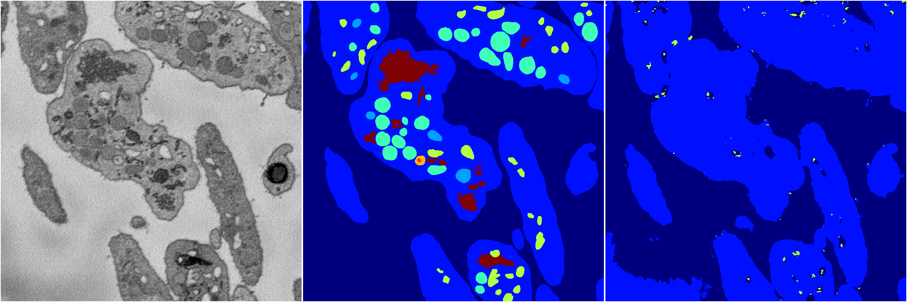
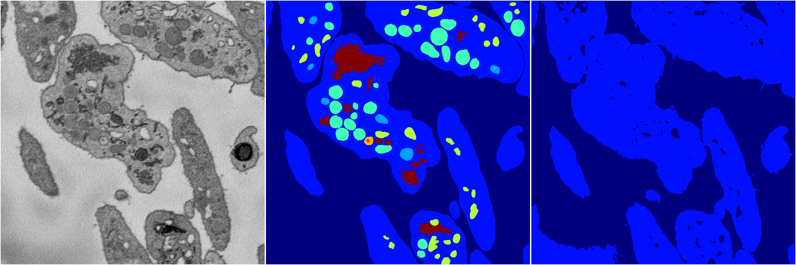
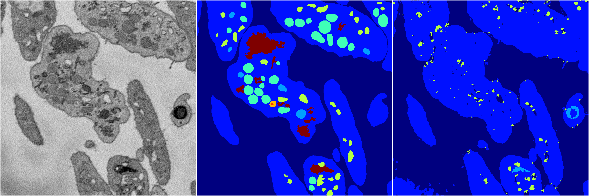

[Back](..)&nbsp;&nbsp;&nbsp;&nbsp;&nbsp;[Home](https://leapmanlab.github.io/snapshots)

---

<a href="4"><h2>random_2d_ed / 1216 / 65 / 4</h2></a>
Created 21 Dec 2018, 14:17:44

<i>Click for more details</i>

**ari**: 0.5384. **miou**: 0.2474. **accuracy**: 0.8659. **n_params**: 11451947.0000. 

---

<a href="1"><h2>random_2d_ed / 1216 / 65 / 1</h2></a>
Created 21 Dec 2018, 14:17:44

<i>Click for more details</i>

**ari**: 0.5119. **miou**: 0.2139. **accuracy**: 0.8536. **n_params**: 11451947.0000. 

---

<a href="2"><h2>random_2d_ed / 1216 / 65 / 2</h2></a>
Created 21 Dec 2018, 14:17:44

<i>Click for more details</i>

**ari**: 0.5105. **miou**: 0.2042. **accuracy**: 0.8515. **n_params**: 11451947.0000. 

---

<a href="3"><h2>random_2d_ed / 1216 / 65 / 3</h2></a>
Created 21 Dec 2018, 14:17:44

<i>Click for more details</i>

**ari**: 0.5319. **miou**: 0.2448. **accuracy**: 0.8640. **n_params**: 11451947.0000. 

---

<a href="0"><h2>random_2d_ed / 1216 / 65 / 0</h2></a>
Created 21 Dec 2018, 14:17:44

<i>Click for more details</i>

**ari**: 0.4844. **miou**: 0.2024. **accuracy**: 0.8471. **n_params**: 11451947.0000. 

---

[Back](..)&nbsp;&nbsp;&nbsp;&nbsp;&nbsp;[Home](https://leapmanlab.github.io/snapshots)

---