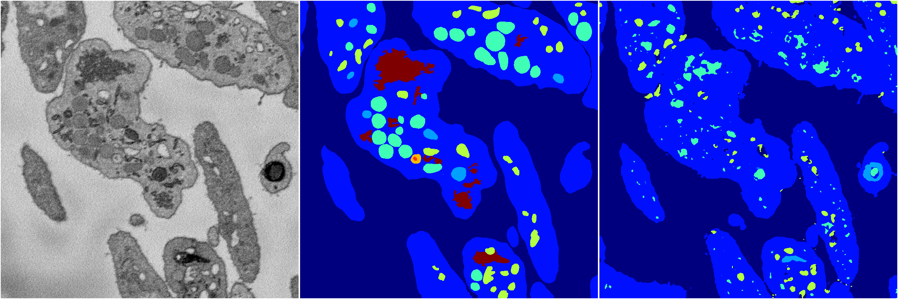
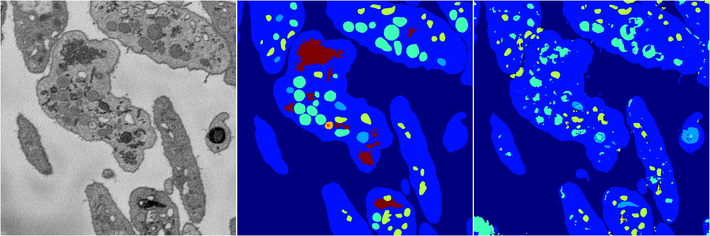
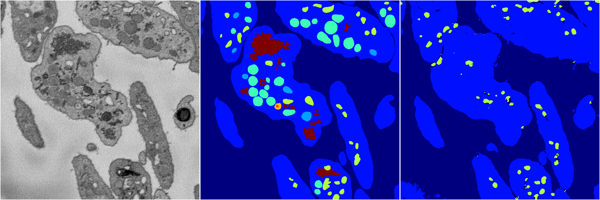

[Back](..)&nbsp;&nbsp;&nbsp;&nbsp;&nbsp;[Home](https://leapmanlab.github.io/snapshots)

---

<a href="2"><h2>random_2d_ed / 1216 / 66 / 2</h2></a>
Created 21 Dec 2018, 01:15:55

<i>Click for more details</i>

**ari**: 0.6753. **miou**: 0.2770. **accuracy**: 0.8520. **n_params**: 383675.0000. 

---

<a href="0"><h2>random_2d_ed / 1216 / 66 / 0</h2></a>
Created 21 Dec 2018, 01:15:55

<i>Click for more details</i>

**ari**: 0.7372. **miou**: 0.3644. **accuracy**: 0.8760. **n_params**: 383675.0000. 

---

<a href="3"><h2>random_2d_ed / 1216 / 66 / 3</h2></a>
Created 21 Dec 2018, 01:15:55

<i>Click for more details</i>

**ari**: 0.7702. **miou**: 0.4405. **accuracy**: 0.8978. **n_params**: 383675.0000. 

---

<a href="1"><h2>random_2d_ed / 1216 / 66 / 1</h2></a>
Created 21 Dec 2018, 01:15:55

<i>Click for more details</i>

**ari**: 0.6822. **miou**: 0.2722. **accuracy**: 0.8649. **n_params**: 383675.0000. 

---

<a href="4"><h2>random_2d_ed / 1216 / 66 / 4</h2></a>
Created 21 Dec 2018, 01:15:55

<i>Click for more details</i>

**ari**: 0.7656. **miou**: 0.4336. **accuracy**: 0.8933. **n_params**: 383675.0000. 

---

[Back](..)&nbsp;&nbsp;&nbsp;&nbsp;&nbsp;[Home](https://leapmanlab.github.io/snapshots)

---