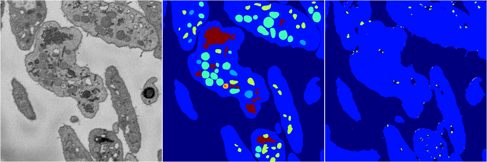
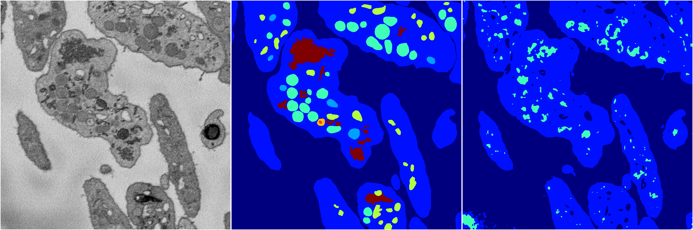
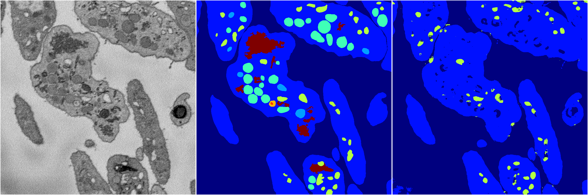
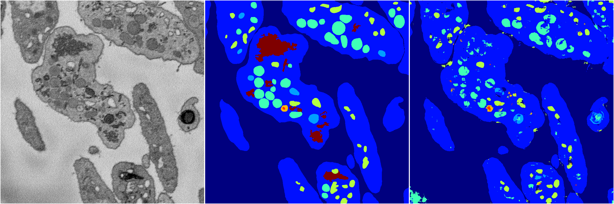
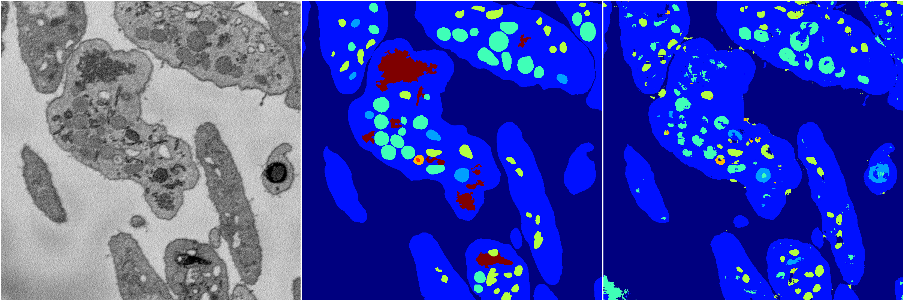

[Back](..)&nbsp;&nbsp;&nbsp;&nbsp;&nbsp;[Home](https://leapmanlab.github.io/snapshots)

---

<a href="4"><h2>random_2d_ed / 1216 / 67 / 4</h2></a>
Created 17 Dec 2018, 23:35:11

<i>Click for more details</i>

**ari**: 0.6178. **miou**: 0.2164. **accuracy**: 0.8425. **n_params**: 1880229.0000. 

---

<a href="3"><h2>random_2d_ed / 1216 / 67 / 3</h2></a>
Created 17 Dec 2018, 23:35:11

<i>Click for more details</i>

**ari**: 0.6939. **miou**: 0.2360. **accuracy**: 0.8557. **n_params**: 1880229.0000. 

---

<a href="2"><h2>random_2d_ed / 1216 / 67 / 2</h2></a>
Created 17 Dec 2018, 23:35:11

<i>Click for more details</i>

**ari**: 0.6884. **miou**: 0.2757. **accuracy**: 0.8641. **n_params**: 1880229.0000. 

---

<a href="1"><h2>random_2d_ed / 1216 / 67 / 1</h2></a>
Created 17 Dec 2018, 23:35:11

<i>Click for more details</i>

**ari**: 0.7456. **miou**: 0.4179. **accuracy**: 0.8848. **n_params**: 1880229.0000. 

---

<a href="0"><h2>random_2d_ed / 1216 / 67 / 0</h2></a>
Created 17 Dec 2018, 23:35:11

<i>Click for more details</i>

**ari**: 0.7519. **miou**: 0.4196. **accuracy**: 0.8879. **n_params**: 1880229.0000. 

---

[Back](..)&nbsp;&nbsp;&nbsp;&nbsp;&nbsp;[Home](https://leapmanlab.github.io/snapshots)

---