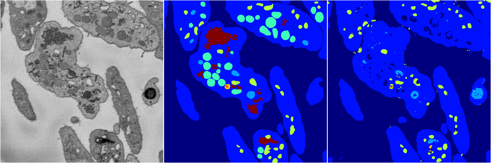
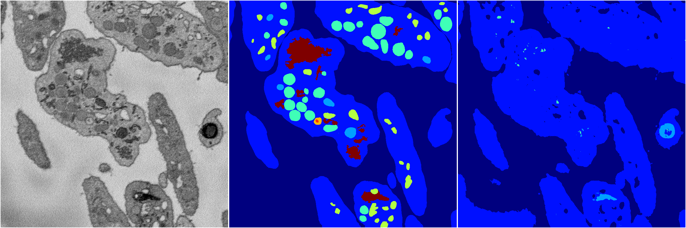
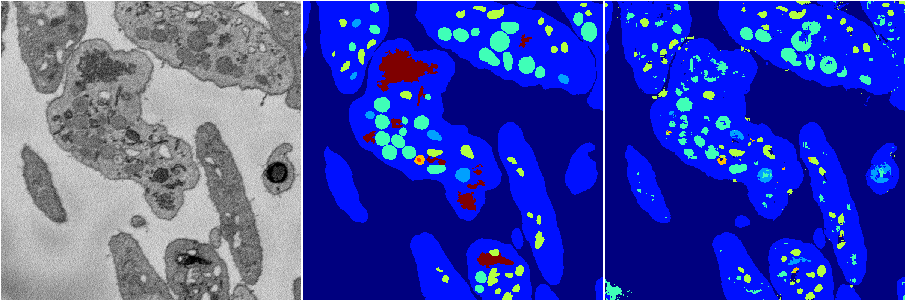

[Back](..)&nbsp;&nbsp;&nbsp;&nbsp;&nbsp;[Home](https://leapmanlab.github.io/snapshots)

---

<a href="2"><h2>random_2d_ed / 1216 / 68 / 2</h2></a>
Created 17 Dec 2018, 23:35:13

<i>Click for more details</i>

**ari**: 0.7156. **miou**: 0.3637. **accuracy**: 0.8747. **n_params**: 446595.0000. 

---

<a href="3"><h2>random_2d_ed / 1216 / 68 / 3</h2></a>
Created 17 Dec 2018, 23:35:13

<i>Click for more details</i>

**ari**: 0.6215. **miou**: 0.2191. **accuracy**: 0.8397. **n_params**: 446595.0000. 

---

<a href="4"><h2>random_2d_ed / 1216 / 68 / 4</h2></a>
Created 17 Dec 2018, 23:35:13

<i>Click for more details</i>

**ari**: 0.7452. **miou**: 0.4234. **accuracy**: 0.8851. **n_params**: 446595.0000. 

---

<a href="1"><h2>random_2d_ed / 1216 / 68 / 1</h2></a>
Created 17 Dec 2018, 23:35:13

<i>Click for more details</i>

**ari**: 0.7545. **miou**: 0.4055. **accuracy**: 0.8857. **n_params**: 446595.0000. 

---

<a href="0"><h2>random_2d_ed / 1216 / 68 / 0</h2></a>
Created 17 Dec 2018, 23:35:13

<i>Click for more details</i>

**ari**: 0.6813. **miou**: 0.2699. **accuracy**: 0.8640. **n_params**: 446595.0000. 

---

[Back](..)&nbsp;&nbsp;&nbsp;&nbsp;&nbsp;[Home](https://leapmanlab.github.io/snapshots)

---