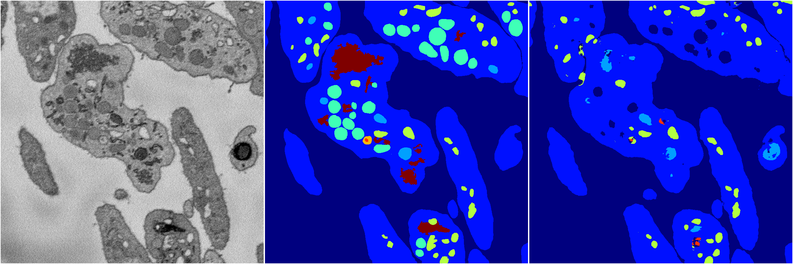
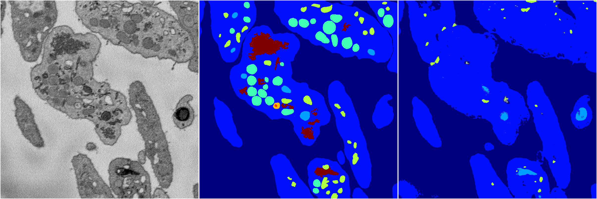
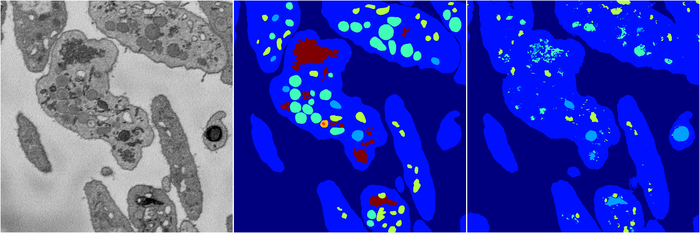
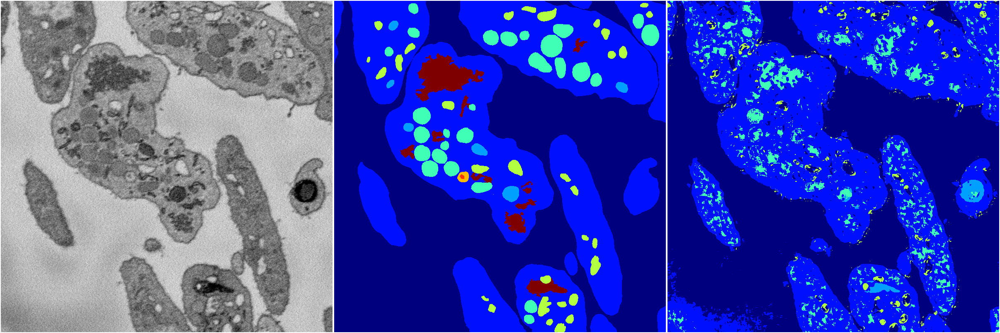

[Back](..)&nbsp;&nbsp;&nbsp;&nbsp;&nbsp;[Home](https://leapmanlab.github.io/snapshots)

---

<a href="0"><h2>random_2d_ed / 1216 / 69 / 0</h2></a>
Created 21 Dec 2018, 01:15:55

<i>Click for more details</i>

**ari**: 0.7589. **miou**: 0.3742. **accuracy**: 0.8981. **n_params**: 4843704.0000. 

---

<a href="3"><h2>random_2d_ed / 1216 / 69 / 3</h2></a>
Created 21 Dec 2018, 01:15:55

<i>Click for more details</i>

**ari**: 0.7974. **miou**: 0.4904. **accuracy**: 0.9161. **n_params**: 4843704.0000. 

---

<a href="1"><h2>random_2d_ed / 1216 / 69 / 1</h2></a>
Created 21 Dec 2018, 01:15:55

<i>Click for more details</i>

**ari**: 0.6512. **miou**: 0.2533. **accuracy**: 0.8662. **n_params**: 4843704.0000. 

---

<a href="4"><h2>random_2d_ed / 1216 / 69 / 4</h2></a>
Created 21 Dec 2018, 01:15:55

<i>Click for more details</i>

**ari**: 0.7058. **miou**: 0.3102. **accuracy**: 0.8804. **n_params**: 4843704.0000. 

---

<a href="2"><h2>random_2d_ed / 1216 / 69 / 2</h2></a>
Created 21 Dec 2018, 01:15:55

<i>Click for more details</i>

**ari**: 0.6424. **miou**: 0.2574. **accuracy**: 0.8393. **n_params**: 4843704.0000. 

---

[Back](..)&nbsp;&nbsp;&nbsp;&nbsp;&nbsp;[Home](https://leapmanlab.github.io/snapshots)

---