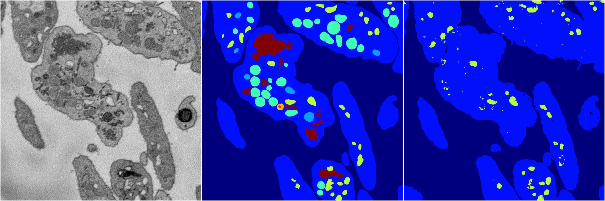
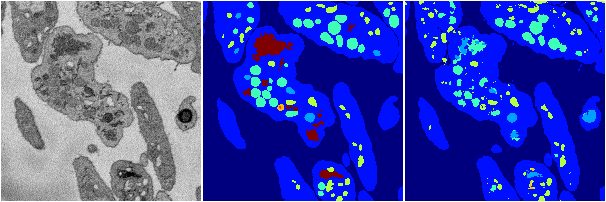
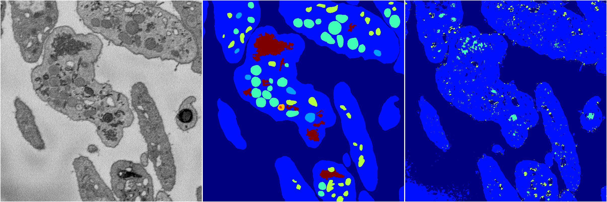

[Back](..)&nbsp;&nbsp;&nbsp;&nbsp;&nbsp;[Home](https://leapmanlab.github.io/snapshots)

---

<a href="4"><h2>random_2d_ed / 1216 / 7 / 4</h2></a>
Created 17 Dec 2018, 02:57:37

<i>Click for more details</i>

**ari**: 0.6858. **miou**: 0.2815. **accuracy**: 0.8881. **n_params**: 79725172.0000. 

---

<a href="1"><h2>random_2d_ed / 1216 / 7 / 1</h2></a>
Created 17 Dec 2018, 02:57:37

<i>Click for more details</i>

**ari**: 0.7551. **miou**: 0.3874. **accuracy**: 0.9000. **n_params**: 79725172.0000. 

---

<a href="3"><h2>random_2d_ed / 1216 / 7 / 3</h2></a>
Created 17 Dec 2018, 02:57:37

<i>Click for more details</i>

**ari**: 0.7890. **miou**: 0.4385. **accuracy**: 0.9144. **n_params**: 79725172.0000. 

---

<a href="0"><h2>random_2d_ed / 1216 / 7 / 0</h2></a>
Created 17 Dec 2018, 02:57:37

<i>Click for more details</i>

**ari**: 0.6315. **miou**: 0.2321. **accuracy**: 0.8567. **n_params**: 79725172.0000. 

---

[Back](..)&nbsp;&nbsp;&nbsp;&nbsp;&nbsp;[Home](https://leapmanlab.github.io/snapshots)

---