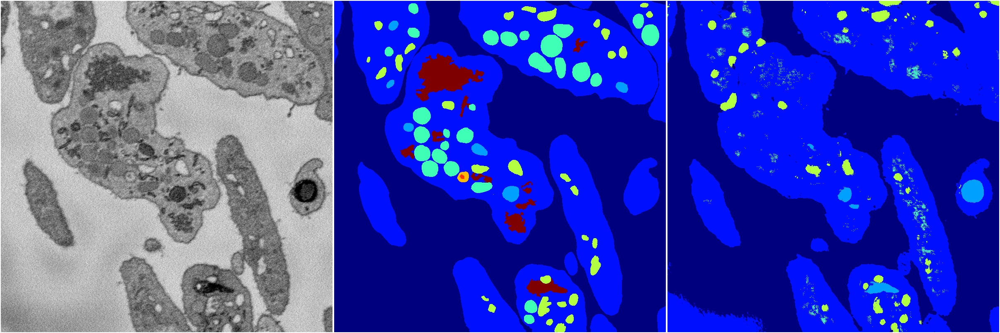
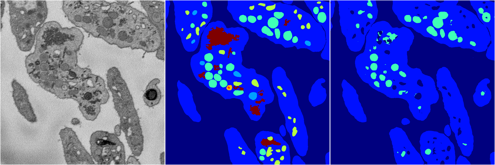
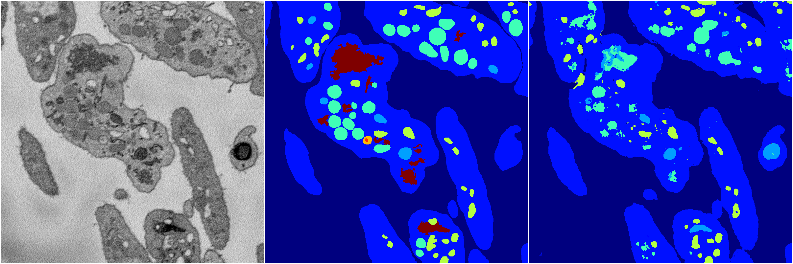
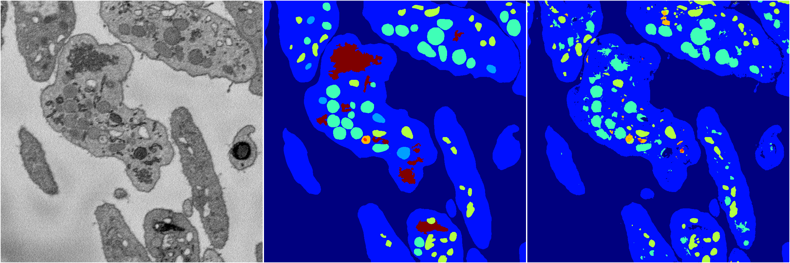

[Back](..)&nbsp;&nbsp;&nbsp;&nbsp;&nbsp;[Home](https://leapmanlab.github.io/snapshots)

---

<a href="4"><h2>random_2d_ed / 1216 / 70 / 4</h2></a>
Created 21 Dec 2018, 14:17:45

<i>Click for more details</i>

**ari**: 0.6859. **miou**: 0.2953. **accuracy**: 0.8729. **n_params**: 2344844.0000. 

---

<a href="3"><h2>random_2d_ed / 1216 / 70 / 3</h2></a>
Created 21 Dec 2018, 14:17:45

<i>Click for more details</i>

**ari**: 0.7587. **miou**: 0.2764. **accuracy**: 0.8951. **n_params**: 2344844.0000. 

---

<a href="2"><h2>random_2d_ed / 1216 / 70 / 2</h2></a>
Created 21 Dec 2018, 14:17:45

<i>Click for more details</i>

**ari**: 0.7940. **miou**: 0.5326. **accuracy**: 0.9122. **n_params**: 2344844.0000. 

---

<a href="1"><h2>random_2d_ed / 1216 / 70 / 1</h2></a>
Created 21 Dec 2018, 14:17:45

<i>Click for more details</i>

**ari**: 0.7674. **miou**: 0.3636. **accuracy**: 0.8971. **n_params**: 2344844.0000. 

---

<a href="0"><h2>random_2d_ed / 1216 / 70 / 0</h2></a>
Created 21 Dec 2018, 14:17:45

<i>Click for more details</i>

**ari**: 0.7480. **miou**: 0.3909. **accuracy**: 0.8908. **n_params**: 2344844.0000. 

---

[Back](..)&nbsp;&nbsp;&nbsp;&nbsp;&nbsp;[Home](https://leapmanlab.github.io/snapshots)

---