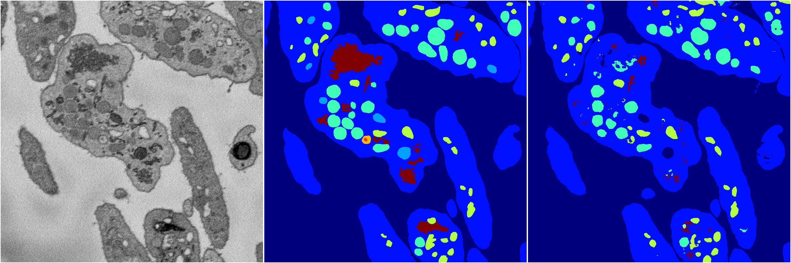
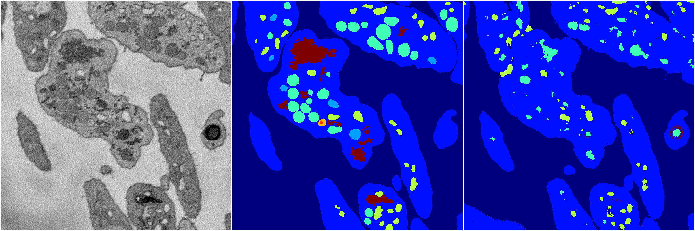
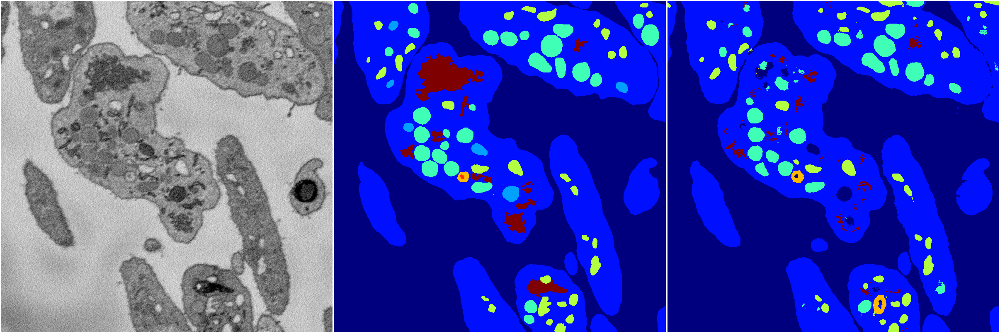

[Back](..)&nbsp;&nbsp;&nbsp;&nbsp;&nbsp;[Home](https://leapmanlab.github.io/snapshots)

---

<a href="4"><h2>random_2d_ed / 1216 / 71 / 4</h2></a>
Created 17 Dec 2018, 23:35:13

<i>Click for more details</i>

**ari**: 0.6511. **miou**: 0.2056. **accuracy**: 0.8617. **n_params**: 1227436.0000. 

---

<a href="3"><h2>random_2d_ed / 1216 / 71 / 3</h2></a>
Created 17 Dec 2018, 23:35:13

<i>Click for more details</i>

**ari**: 0.8018. **miou**: 0.4285. **accuracy**: 0.9151. **n_params**: 1227436.0000. 

---

<a href="2"><h2>random_2d_ed / 1216 / 71 / 2</h2></a>
Created 17 Dec 2018, 23:35:13

<i>Click for more details</i>

**ari**: 0.7411. **miou**: 0.2869. **accuracy**: 0.8839. **n_params**: 1227436.0000. 

---

<a href="1"><h2>random_2d_ed / 1216 / 71 / 1</h2></a>
Created 17 Dec 2018, 23:35:13

<i>Click for more details</i>

**ari**: 0.8048. **miou**: 0.4495. **accuracy**: 0.9117. **n_params**: 1227436.0000. 

---

<a href="0"><h2>random_2d_ed / 1216 / 71 / 0</h2></a>
Created 17 Dec 2018, 23:35:13

<i>Click for more details</i>

**ari**: 0.8026. **miou**: 0.4254. **accuracy**: 0.9149. **n_params**: 1227436.0000. 

---

[Back](..)&nbsp;&nbsp;&nbsp;&nbsp;&nbsp;[Home](https://leapmanlab.github.io/snapshots)

---