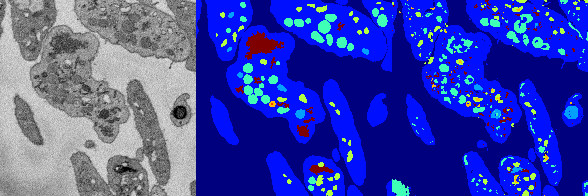
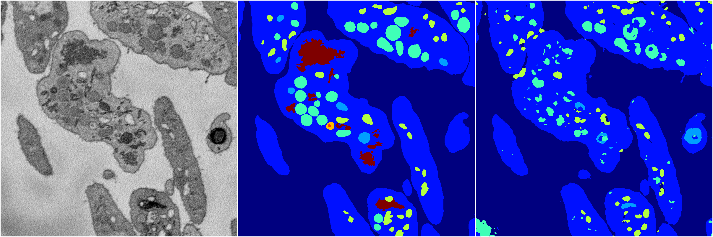
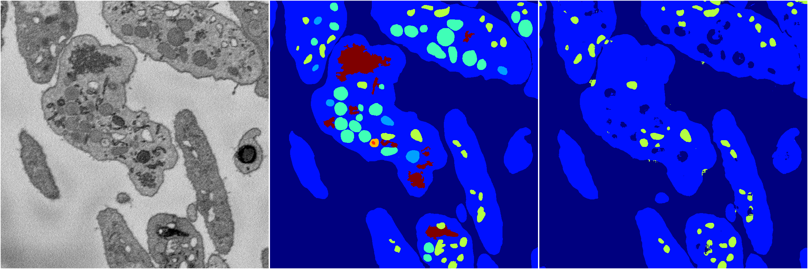

[Back](..)&nbsp;&nbsp;&nbsp;&nbsp;&nbsp;[Home](https://leapmanlab.github.io/snapshots)

---

<a href="3"><h2>random_2d_ed / 1216 / 72 / 3</h2></a>
Created 17 Dec 2018, 23:35:14

<i>Click for more details</i>

**ari**: 0.7060. **miou**: 0.3389. **accuracy**: 0.8704. **n_params**: 1081852.0000. 

---

<a href="4"><h2>random_2d_ed / 1216 / 72 / 4</h2></a>
Created 17 Dec 2018, 23:35:14

<i>Click for more details</i>

**ari**: 0.7411. **miou**: 0.4050. **accuracy**: 0.8762. **n_params**: 1081852.0000. 

---

<a href="2"><h2>random_2d_ed / 1216 / 72 / 2</h2></a>
Created 17 Dec 2018, 23:35:14

<i>Click for more details</i>

**ari**: 0.7478. **miou**: 0.3652. **accuracy**: 0.8850. **n_params**: 1081852.0000. 

---

<a href="1"><h2>random_2d_ed / 1216 / 72 / 1</h2></a>
Created 17 Dec 2018, 23:35:13

<i>Click for more details</i>

**ari**: 0.7748. **miou**: 0.4586. **accuracy**: 0.8963. **n_params**: 1081852.0000. 

---

<a href="0"><h2>random_2d_ed / 1216 / 72 / 0</h2></a>
Created 17 Dec 2018, 23:35:13

<i>Click for more details</i>

**ari**: 0.7144. **miou**: 0.2871. **accuracy**: 0.8747. **n_params**: 1081852.0000. 

---

[Back](..)&nbsp;&nbsp;&nbsp;&nbsp;&nbsp;[Home](https://leapmanlab.github.io/snapshots)

---