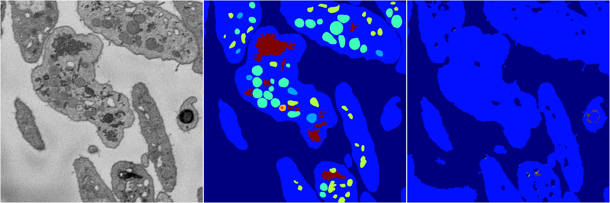
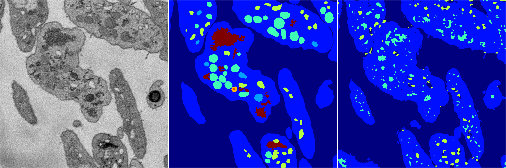
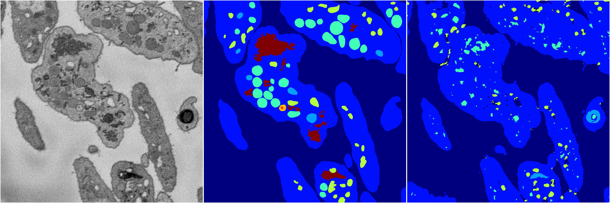
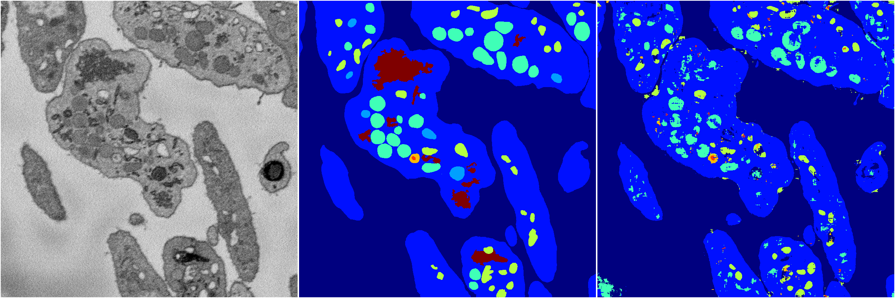

[Back](..)&nbsp;&nbsp;&nbsp;&nbsp;&nbsp;[Home](https://leapmanlab.github.io/snapshots)

---

<a href="4"><h2>random_2d_ed / 1216 / 73 / 4</h2></a>
Created 21 Dec 2018, 14:17:45

<i>Click for more details</i>

**ari**: 0.6037. **miou**: 0.2028. **accuracy**: 0.8370. **n_params**: 784308.0000. 

---

<a href="3"><h2>random_2d_ed / 1216 / 73 / 3</h2></a>
Created 21 Dec 2018, 14:17:45

<i>Click for more details</i>

**ari**: 0.6753. **miou**: 0.2735. **accuracy**: 0.8508. **n_params**: 784308.0000. 

---

<a href="2"><h2>random_2d_ed / 1216 / 73 / 2</h2></a>
Created 21 Dec 2018, 14:17:45

<i>Click for more details</i>

**ari**: 0.6781. **miou**: 0.2666. **accuracy**: 0.8521. **n_params**: 784308.0000. 

---

<a href="0"><h2>random_2d_ed / 1216 / 73 / 0</h2></a>
Created 21 Dec 2018, 14:17:45

<i>Click for more details</i>

**ari**: 0.7139. **miou**: 0.3402. **accuracy**: 0.8662. **n_params**: 784308.0000. 

---

<a href="1"><h2>random_2d_ed / 1216 / 73 / 1</h2></a>
Created 21 Dec 2018, 14:17:45

<i>Click for more details</i>

**ari**: 0.7203. **miou**: 0.3411. **accuracy**: 0.8688. **n_params**: 784308.0000. 

---

[Back](..)&nbsp;&nbsp;&nbsp;&nbsp;&nbsp;[Home](https://leapmanlab.github.io/snapshots)

---