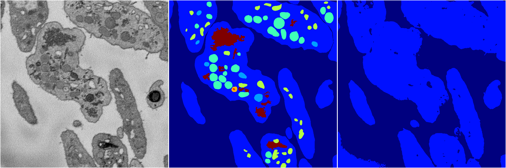
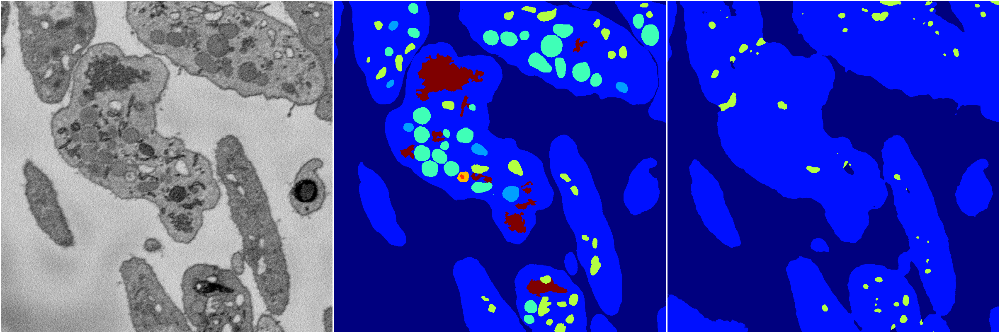
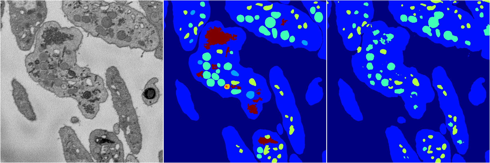
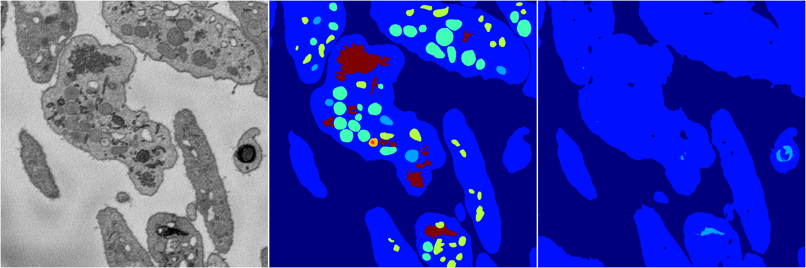

[Back](..)&nbsp;&nbsp;&nbsp;&nbsp;&nbsp;[Home](https://leapmanlab.github.io/snapshots)

---

<a href="3"><h2>random_2d_ed / 1216 / 74 / 3</h2></a>
Created 21 Dec 2018, 01:15:55

<i>Click for more details</i>

**ari**: 0.6333. **miou**: 0.2060. **accuracy**: 0.8562. **n_params**: 486563.0000. 

---

<a href="1"><h2>random_2d_ed / 1216 / 74 / 1</h2></a>
Created 21 Dec 2018, 01:15:55

<i>Click for more details</i>

**ari**: 0.6698. **miou**: 0.2455. **accuracy**: 0.8693. **n_params**: 486563.0000. 

---

<a href="4"><h2>random_2d_ed / 1216 / 74 / 4</h2></a>
Created 21 Dec 2018, 01:15:55

<i>Click for more details</i>

**ari**: 0.7863. **miou**: 0.3539. **accuracy**: 0.9039. **n_params**: 486563.0000. 

---

<a href="2"><h2>random_2d_ed / 1216 / 74 / 2</h2></a>
Created 21 Dec 2018, 01:15:55

<i>Click for more details</i>

**ari**: 0.6509. **miou**: 0.2119. **accuracy**: 0.8623. **n_params**: 486563.0000. 

---

<a href="0"><h2>random_2d_ed / 1216 / 74 / 0</h2></a>
Created 21 Dec 2018, 01:15:55

<i>Click for more details</i>

**ari**: 0.7001. **miou**: 0.2790. **accuracy**: 0.8806. **n_params**: 486563.0000. 

---

[Back](..)&nbsp;&nbsp;&nbsp;&nbsp;&nbsp;[Home](https://leapmanlab.github.io/snapshots)

---