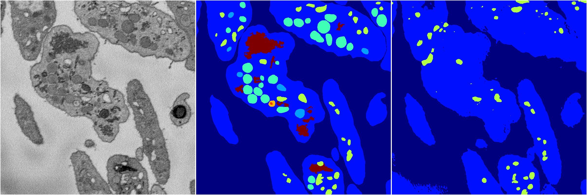
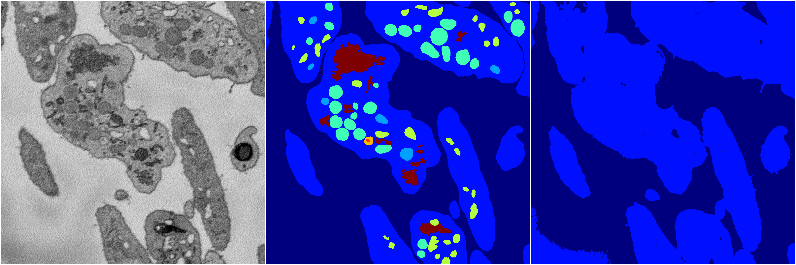
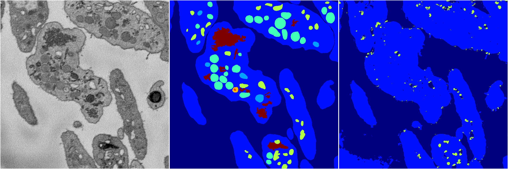
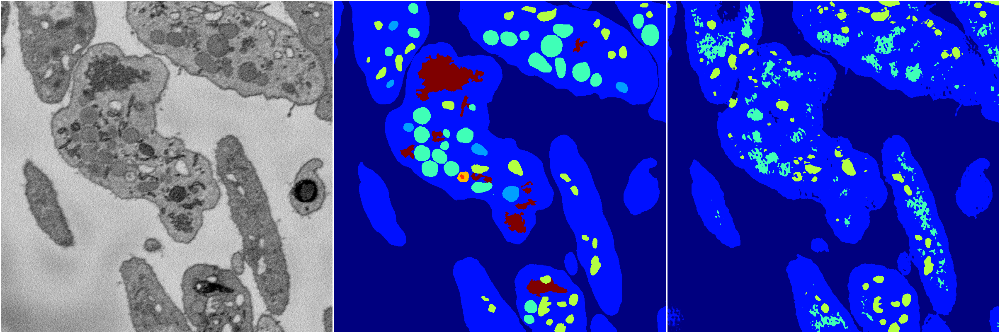

[Back](..)&nbsp;&nbsp;&nbsp;&nbsp;&nbsp;[Home](https://leapmanlab.github.io/snapshots)

---

<a href="0"><h2>random_2d_ed / 1216 / 75 / 0</h2></a>
Created 21 Dec 2018, 01:15:55

<i>Click for more details</i>

**ari**: 0.7232. **miou**: 0.3611. **accuracy**: 0.9059. **n_params**: 15629314.0000. 

---

<a href="3"><h2>random_2d_ed / 1216 / 75 / 3</h2></a>
Created 21 Dec 2018, 01:15:55

<i>Click for more details</i>

**ari**: 0.5895. **miou**: 0.2701. **accuracy**: 0.8699. **n_params**: 15629314.0000. 

---

<a href="1"><h2>random_2d_ed / 1216 / 75 / 1</h2></a>
Created 21 Dec 2018, 01:15:55

<i>Click for more details</i>

**ari**: 0.5327. **miou**: 0.2060. **accuracy**: 0.8562. **n_params**: 15629314.0000. 

---

<a href="4"><h2>random_2d_ed / 1216 / 75 / 4</h2></a>
Created 21 Dec 2018, 01:15:55

<i>Click for more details</i>

**ari**: 0.5552. **miou**: 0.2378. **accuracy**: 0.8609. **n_params**: 15629314.0000. 

---

<a href="2"><h2>random_2d_ed / 1216 / 75 / 2</h2></a>
Created 21 Dec 2018, 01:15:55

<i>Click for more details</i>

**ari**: 0.6189. **miou**: 0.2999. **accuracy**: 0.8639. **n_params**: 15629314.0000. 

---

[Back](..)&nbsp;&nbsp;&nbsp;&nbsp;&nbsp;[Home](https://leapmanlab.github.io/snapshots)

---