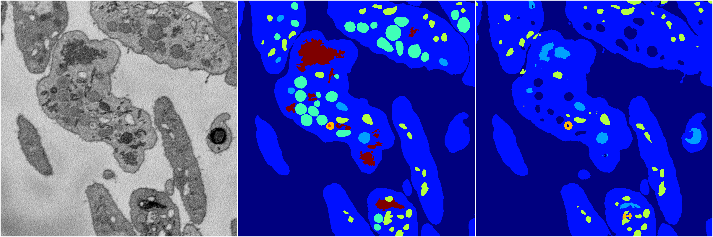
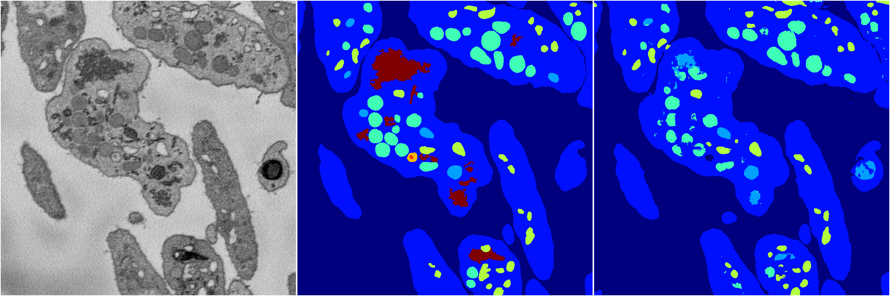
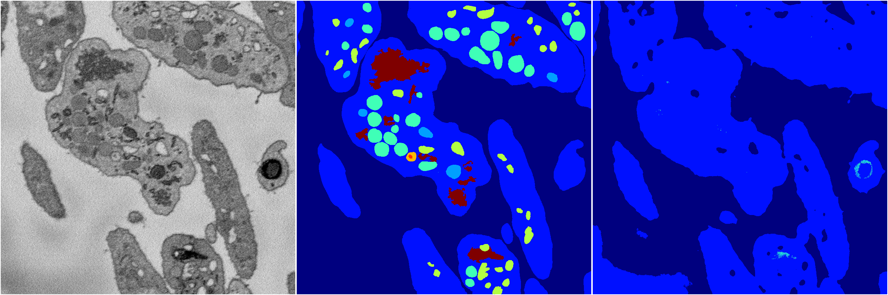
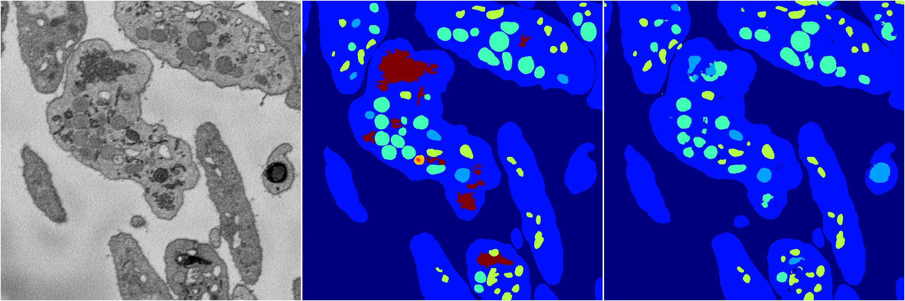

[Back](..)&nbsp;&nbsp;&nbsp;&nbsp;&nbsp;[Home](https://leapmanlab.github.io/snapshots)

---

<a href="0"><h2>random_2d_ed / 1216 / 76 / 0</h2></a>
Created 21 Dec 2018, 01:15:55

<i>Click for more details</i>

**ari**: 0.7819. **miou**: 0.3892. **accuracy**: 0.9040. **n_params**: 2780189.0000. 

---

<a href="3"><h2>random_2d_ed / 1216 / 76 / 3</h2></a>
Created 21 Dec 2018, 01:15:55

<i>Click for more details</i>

**ari**: 0.8138. **miou**: 0.4267. **accuracy**: 0.9172. **n_params**: 2780189.0000. 

---

<a href="1"><h2>random_2d_ed / 1216 / 76 / 1</h2></a>
Created 21 Dec 2018, 01:15:55

<i>Click for more details</i>

**ari**: 0.6721. **miou**: 0.2094. **accuracy**: 0.8675. **n_params**: 2780189.0000. 

---

<a href="4"><h2>random_2d_ed / 1216 / 76 / 4</h2></a>
Created 21 Dec 2018, 01:15:55

<i>Click for more details</i>

**ari**: 0.8140. **miou**: 0.4339. **accuracy**: 0.9185. **n_params**: 2780189.0000. 

---

<a href="2"><h2>random_2d_ed / 1216 / 76 / 2</h2></a>
Created 21 Dec 2018, 01:15:55

<i>Click for more details</i>

**ari**: 0.8198. **miou**: 0.4949. **accuracy**: 0.9210. **n_params**: 2780189.0000. 

---

[Back](..)&nbsp;&nbsp;&nbsp;&nbsp;&nbsp;[Home](https://leapmanlab.github.io/snapshots)

---