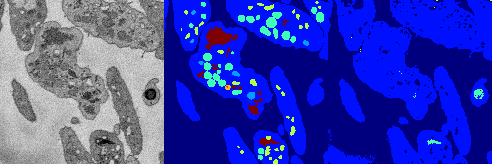
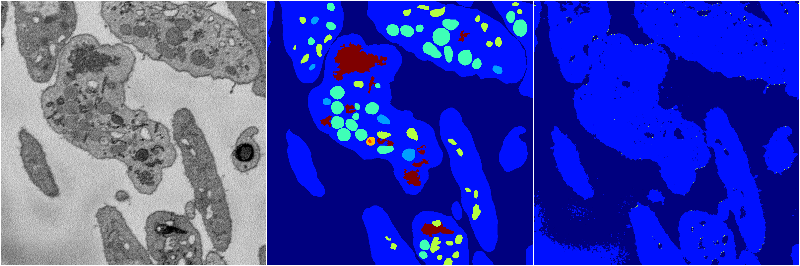
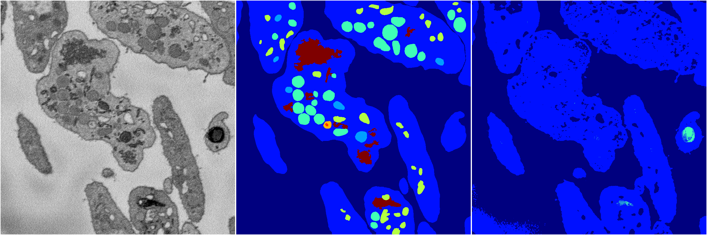
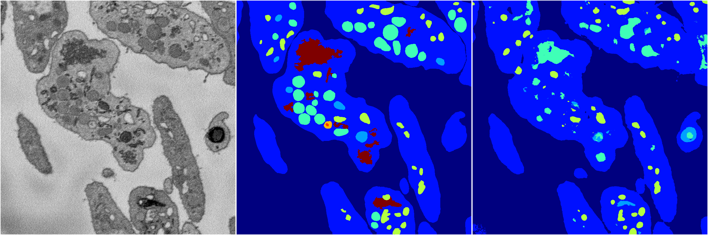

[Back](..)&nbsp;&nbsp;&nbsp;&nbsp;&nbsp;[Home](https://leapmanlab.github.io/snapshots)

---

<a href="4"><h2>random_2d_ed / 1216 / 78 / 4</h2></a>
Created 17 Dec 2018, 23:35:14

<i>Click for more details</i>

**ari**: 0.7111. **miou**: 0.3772. **accuracy**: 0.8971. **n_params**: 9815751.0000. 

---

<a href="3"><h2>random_2d_ed / 1216 / 78 / 3</h2></a>
Created 17 Dec 2018, 23:35:14

<i>Click for more details</i>

**ari**: 0.5394. **miou**: 0.2033. **accuracy**: 0.8462. **n_params**: 9815751.0000. 

---

<a href="2"><h2>random_2d_ed / 1216 / 78 / 2</h2></a>
Created 17 Dec 2018, 23:35:14

<i>Click for more details</i>

**ari**: 0.5128. **miou**: 0.2043. **accuracy**: 0.8465. **n_params**: 9815751.0000. 

---

<a href="0"><h2>random_2d_ed / 1216 / 78 / 0</h2></a>
Created 17 Dec 2018, 23:35:14

<i>Click for more details</i>

**ari**: 0.5322. **miou**: 0.1995. **accuracy**: 0.8406. **n_params**: 9815751.0000. 

---

<a href="1"><h2>random_2d_ed / 1216 / 78 / 1</h2></a>
Created 17 Dec 2018, 23:35:14

<i>Click for more details</i>

**ari**: 0.6792. **miou**: 0.3350. **accuracy**: 0.8846. **n_params**: 9815751.0000. 

---

[Back](..)&nbsp;&nbsp;&nbsp;&nbsp;&nbsp;[Home](https://leapmanlab.github.io/snapshots)

---