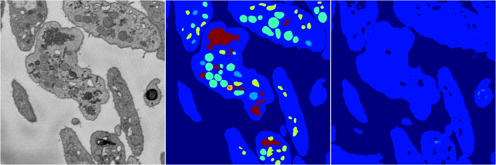
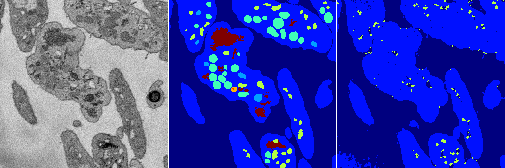
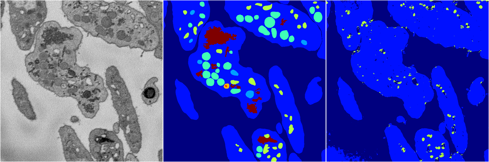
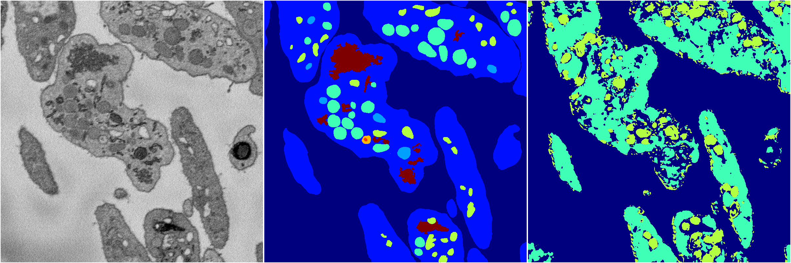

[Back](..)&nbsp;&nbsp;&nbsp;&nbsp;&nbsp;[Home](https://leapmanlab.github.io/snapshots)

---

<a href="0"><h2>random_2d_ed / 1216 / 79 / 0</h2></a>
Created 21 Dec 2018, 01:15:55

<i>Click for more details</i>

**ari**: 0.5418. **miou**: 0.2037. **accuracy**: 0.8513. **n_params**: 6818564.0000. 

---

<a href="3"><h2>random_2d_ed / 1216 / 79 / 3</h2></a>
Created 21 Dec 2018, 01:15:55

<i>Click for more details</i>

**ari**: 0.5604. **miou**: 0.2468. **accuracy**: 0.8689. **n_params**: 6818564.0000. 

---

<a href="1"><h2>random_2d_ed / 1216 / 79 / 1</h2></a>
Created 21 Dec 2018, 01:15:55

<i>Click for more details</i>

**ari**: 0.6340. **miou**: 0.2944. **accuracy**: 0.8871. **n_params**: 6818564.0000. 

---

<a href="4"><h2>random_2d_ed / 1216 / 79 / 4</h2></a>
Created 21 Dec 2018, 01:15:55

<i>Click for more details</i>

**ari**: 0.5585. **miou**: 0.2451. **accuracy**: 0.8660. **n_params**: 6818564.0000. 

---

<a href="2"><h2>random_2d_ed / 1216 / 79 / 2</h2></a>
Created 21 Dec 2018, 01:15:55

<i>Click for more details</i>

**ari**: 0.2861. **miou**: 0.1284. **accuracy**: 0.4963. **n_params**: 6818564.0000. 

---

[Back](..)&nbsp;&nbsp;&nbsp;&nbsp;&nbsp;[Home](https://leapmanlab.github.io/snapshots)

---