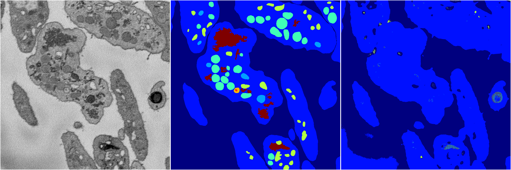
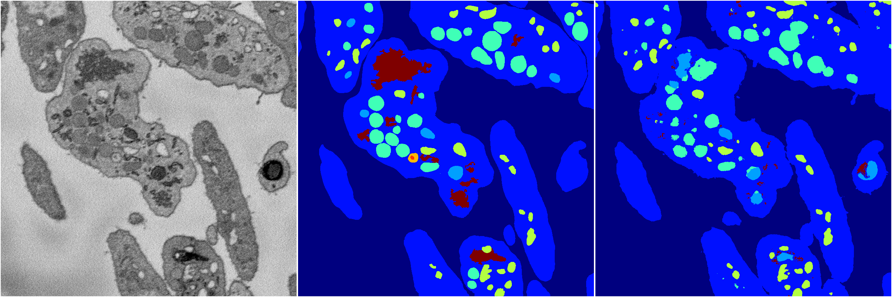
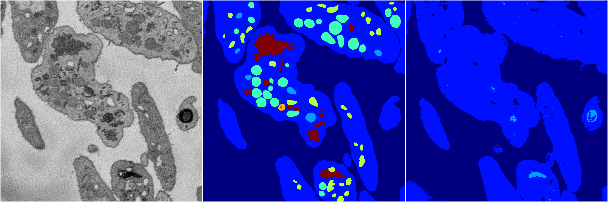
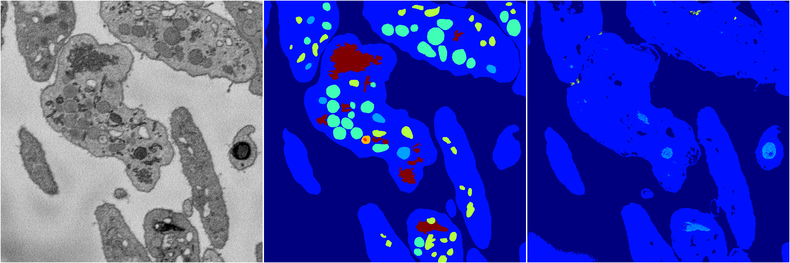
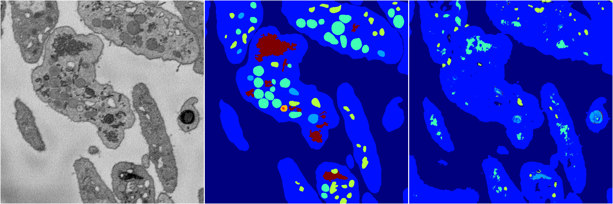

[Back](..)&nbsp;&nbsp;&nbsp;&nbsp;&nbsp;[Home](https://leapmanlab.github.io/snapshots)

---

<a href="3"><h2>random_2d_ed / 1216 / 8 / 3</h2></a>
Created 17 Dec 2018, 23:35:08

<i>Click for more details</i>

**ari**: 0.6368. **miou**: 0.2223. **accuracy**: 0.8611. **n_params**: 3804672.0000. 

---

<a href="4"><h2>random_2d_ed / 1216 / 8 / 4</h2></a>
Created 17 Dec 2018, 23:35:08

<i>Click for more details</i>

**ari**: 0.7267. **miou**: 0.4007. **accuracy**: 0.8924. **n_params**: 3804672.0000. 

---

<a href="2"><h2>random_2d_ed / 1216 / 8 / 2</h2></a>
Created 17 Dec 2018, 23:35:08

<i>Click for more details</i>

**ari**: 0.6629. **miou**: 0.2249. **accuracy**: 0.8708. **n_params**: 3804672.0000. 

---

<a href="0"><h2>random_2d_ed / 1216 / 8 / 0</h2></a>
Created 17 Dec 2018, 23:35:08

<i>Click for more details</i>

**ari**: 0.6489. **miou**: 0.2296. **accuracy**: 0.8649. **n_params**: 3804672.0000. 

---

<a href="1"><h2>random_2d_ed / 1216 / 8 / 1</h2></a>
Created 17 Dec 2018, 23:35:08

<i>Click for more details</i>

**ari**: 0.6758. **miou**: 0.2557. **accuracy**: 0.8642. **n_params**: 3804672.0000. 

---

[Back](..)&nbsp;&nbsp;&nbsp;&nbsp;&nbsp;[Home](https://leapmanlab.github.io/snapshots)

---